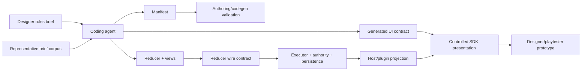

# Competition Game Authoring Capability Hard Cut

Status: closed on 2026-06-19. SDK Phase 05 reference-suite preparation,
required internal parity, SDK release proof, public SDK package availability,
public Dreamboard docs/skill source proof, CLI/dev-host `0.1.30-alpha.18` npm
publication, public authoring compatibility proof, internal authoring
release-set repin, `pnpm fin`, `pnpm verify:dev`, `pnpm verify:stack`,
`pnpm verify:browser`, `pnpm verify:package`, and `pnpm verify:full` passed.
Internal terminal-transport source cutover and focused terminal callback,
reconnect event-batch, host ended-event, and history-restore regressions passed.
Broader packed reconnect/event-history E2E remains recorded as a non-blocking
follow-up outside this capability hard cut.

This is a standalone successor to
[Competition Game Framework Capabilities](../competition-game-framework-capabilities/README.md).
The earlier document remains useful as problem discovery, but this plan replaces
its implementation strategy.

## Executive Decision

Optimize the framework for this end-to-end job:

> A coding agent can turn a short rules brief from a low-technical-experience
> board-game designer into a deterministic, mobile-playable browser prototype
> without inventing framework concepts or bypassing Dreamboard's authority
> model.

The designer is the product user. The coding agent is the primary public SDK
user. Framework maintainers are the secondary SDK user.

The implementation must therefore minimize concepts and failure ambiguity for
the coding agent while producing a prototype that makes setup, legal actions,
automated procedures, and final results clear to the designer and their
playtesters.

## Why The Strategy Changes

The current proposal identifies useful problem areas, but its target concepts
would make the framework harder to use in several places.

1. Forum keyword counts are demand signals, not a mechanic taxonomy. They do
   not prove that a new runtime abstraction is needed.
2. A separate sheet runtime and sheet input family would duplicate existing
   board topology, board-space collectors, drafts, and semantic browser
   interaction.
3. Physical-format checks are secondary authoring lint. They must derive what
   they can from existing declarations and must not introduce board-carrier or
   manufacturing fields into the game manifest.
4. Scoring is already a cross-repository terminal contract. A presentation-only
   score model would be stripped or contradicted by executor, authority,
   persistence, callback, and host boundaries.
5. An automa is usually a deterministic game procedure, not an authenticated
   participant. Modeling it as a fake player corrupts actor authorization,
   private-state projection, session seats, and analytics.
6. Deferring playable reference games until the last phase allows speculative
   APIs to accumulate. Each capability must instead be earned by a working
   original microgame in the phase that introduces it.

## Intended Users And Jobs

| User         | Job                                                    | Framework success condition                                                                                    |
| ------------ | ------------------------------------------------------ | -------------------------------------------------------------------------------------------------------------- |
| Designer     | Explain a compact game in ordinary rules language      | The brief maps to existing framework concepts with no hidden architecture decisions required from the designer |
| Coding agent | Implement the brief quickly and correctly              | Generated types guide the implementation; diagnostics identify rule, target, and contract failures             |
| Playtester   | Understand what to do and why an action is unavailable | Setup, current objective, action help, authoritative disabled reason, and automated actions are visible        |
| Maintainer   | Extend the framework without parallel models           | New behavior has one source of truth, one wire representation, and a vertical release proof                    |

The new anchor user journeys are:

1. A roll-and-write scorecard with dice-driven marking.
2. A small multiplayer game with ranked results, ties, and tie-break evidence.
3. A solo countdown puzzle with deterministic environment procedures.
4. An automa rival with deterministic actions and an inspectable event log.

These are original mechanic fixtures, not copies of commercial games or contest
entries.

## Canonical Example Strategy

Canonical examples are public teaching assets, not incidental test fixtures.
Each example demonstrates one common game family and the smallest canonical SDK
design for it.

Existing examples remain canonical for the families they already cover:

| Game family            | Existing example             |
| ---------------------- | ---------------------------- |
| Trick-taking           | `hearts`                     |
| Simultaneous drafting  | `simultaneous-card-drafting` |
| Deck-building market   | `deck-building-market`       |
| Worker placement       | `worker-placement-tableau`   |
| Route/network building | `hex-network-trading`        |

This plan adds:

| Game family         | New canonical example          | Owning phase | Primary lesson                                                   |
| ------------------- | ------------------------------ | ------------ | ---------------------------------------------------------------- |
| Roll and write      | `roll-and-write-scorecard`     | Phase 01     | Per-player square board plus generated `Board.SquareGrid`        |
| Multiplayer ranking | `multiplayer-ranking-and-ties` | Phase 02     | Canonical outcomes, ties, breakdowns, and tie-breaks             |
| Solo puzzle         | `solo-countdown-puzzle`        | Phase 04     | Auto phases and system events without an opponent identity       |
| Automa rival        | `automa-river-rival`           | Phase 04     | Deterministic rival state and actions without a fake player seat |

The exact original rules, state skeletons, terminal conditions, and required
scenario branches are defined in
[Canonical Game Briefs](canonical-game-briefs.md). The labels above are not
placeholders for the implementation team to reinterpret.

Rules:

- each new example lands in the phase that introduces its capability;
- each is a complete original playable game with README, scenarios, packed
  proof, and mobile coverage where relevant;
- Phase 05 promotes them into the release-required catalog but does not defer
  their implementation;
- commercial game names, copied rules, art, and trade dress are prohibited; and
- physical component counts may be recorded as optional notes but cannot decide
  SDK contract shape.

## Architecture



### Ownership Boundaries

| Concern                                | Owner                                                  | Rule                                                                                        |
| -------------------------------------- | ------------------------------------------------------ | ------------------------------------------------------------------------------------------- |
| Optional physical-format lint          | Repository tooling                                     | Derives existing card/piece/die declarations; cannot change SDK contracts                   |
| Markable grids and compact tracks      | Existing board topology and collectors                 | No `Sheet` runtime, `sheetCell` collector, or second target protocol                        |
| Compact visual treatment               | Authored game UI first; public SDK only after evidence | No physical-format component contract; promote only repeated controlled behavior            |
| Legal actions and disabled reasons     | Reducer rules and descriptors                          | UI renders projected authority and never recomputes eligibility                             |
| Final result                           | Reducer `GameOutcome`                                  | One canonical payload through SDK wire, executor, authority, persistence, backend, and host |
| Automated procedures                   | Auto phases plus deterministic `GameEvent` output      | No fake player seat or non-human session actor                                              |
| Pure visual states                     | Storybook                                              | No runtime provider                                                                         |
| Runtime-generated UI behavior          | UI Workbench                                           | Uses portable fixtures and generated UI contracts                                           |
| Real product transport and host parity | Internal monorepo                                      | Proved against an exact packed or locally published SDK version                             |
| Public guides and agent instructions   | Public `dreamboard-games/dreamboard` checkout          | Updated only after the owning SDK API is released                                           |

## Hard-Cut Invariants

1. **One topology model.** Board spaces, edges, vertices, and existing
   collectors remain the only compact-surface target model.
2. **Physical lint cannot shape gameplay contracts.** Optional checks may
   inspect existing card, piece, and die declarations, but they cannot add
   fields to `GameTopologyManifest`, reducer state, generated UI contracts, or
   host transport.
3. **One terminal result.** `GameOutcome` replaces the current
   winner-plus-score-map payload everywhere. No compatibility alias remains
   after the coordinated cut.
4. **One reason for unavailability.** The UI displays descriptor availability;
   it does not maintain a second rules engine or player-facing reason map.
5. **Humans own seats.** Session actors and player IDs continue to represent
   real participants. Automated game procedures emit events instead.
6. **Presentation does not submit gameplay.** Public UI components recognize
   generic intent; generated runtime adapters bind intent to typed collectors.
7. **No speculative API.** A public capability lands only with a playable
   anchor fixture, Storybook states where relevant, runtime tests, and packed
   consumer proof.
8. **No long-lived bridge.** Breaking phases migrate SDK examples and internal
   consumers in a coordinated version train instead of retaining duplicate
   APIs.

## Target Public Shape

The following examples show the intended direction. Phase documents own the
exact implementation and migration details.

### Roll-And-Write Square Grid

```ts
boards: [
  {
    id: "scorecard-grid",
    name: "Scorecard grid",
    layout: "square",
    scope: "perPlayer",
    spaces: cells,
  },
];
```

```tsx
const useSurfaces = UI.defineSurfaces({
  grid: Board.surface("scorecard-grid"),
});

function Scorecard() {
  const { grid } = useSurfaces();

  return (
    <ScorecardFrame>
      <grid.Root>
        <Board.SquareGrid
          board="scorecard-grid"
          renderPiece={() => null}
          renderCell={(row, col) => {
            const id = cellId(row, col);
            return <GameMarkCell size={60} mark={view.marks[id] ?? "empty"} />;
          }}
        />
      </grid.Root>
    </ScorecardFrame>
  );
}
```

The board manifest describes gameplay topology only. The choice to present it
inside the game-local `ScorecardFrame` belongs to React composition and creates
no board-to-card relationship in runtime state or generated contracts. If at
least two reference games prove the same controlled behavior, a separately
reviewed generic presentation primitive may be proposed.

`Board.SquareGrid` is the relevant framework addition. It is the square-board
counterpart to the existing generated `Board.HexGrid`: it connects existing
square topology to the existing board target layer without DOM wrappers inside
the SVG scene.

### Current SDK Delta

| Concern                   | Current SDK                                                                                        | Revised plan                                                         |
| ------------------------- | -------------------------------------------------------------------------------------------------- | -------------------------------------------------------------------- |
| Square topology           | `BoardSpec` already supports `layout: "square"` with spaces, edges, and vertices                   | Reuse unchanged                                                      |
| Generated static data     | Manifest contracts already expose `staticBoards.square`                                            | Thread the existing map into the workspace UI contract               |
| Board interaction surface | Generated `Board.surface()` already provides `Root`, target components, and typed input slots      | Reuse `Root` and slots unchanged                                     |
| Controlled renderer       | Public `SquareGrid` already renders square topology and accepts explicit interactive target layers | Reuse as the presentation implementation                             |
| Runtime-aware renderer    | `Board.HexGrid` already binds board target layers for SVG hex grids; no square counterpart exists  | Add generated `Board.SquareGrid` with the same interaction semantics |
| Physical carrier          | `BoardSpec` has no `printedOn` or carrier field                                                    | Keep it that way                                                     |
| Physical-format checking  | No framework contract is required                                                                  | Optional repository lint may inspect existing component counts only  |

### Canonical Outcome

```ts
return endGame(nextState, {
  reason: {
    code: "ROUND_LIMIT_REACHED",
    message: "The fourth round is complete.",
  },
  standings: [
    {
      playerId: "player-1",
      rank: 1,
      result: "win",
      score: 18,
      scoreBreakdown: [
        { id: "routes", label: "Routes", value: 12 },
        { id: "bonuses", label: "Bonuses", value: 6 },
      ],
      tieBreaks: [{ id: "cards-left", label: "Cards left", value: 2 }],
    },
    {
      playerId: "player-2",
      rank: 2,
      result: "loss",
      score: 16,
    },
  ],
});
```

### Deterministic Automated Procedure

```ts
return accept(nextState, {
  instructions: [fx.transition("playerTurn")],
  events: [
    gameEvent.systemAction({
      procedureId: "river-advance",
      title: "The river advanced",
      summary: "The leftmost card was discarded and a new card was revealed.",
      details: [{ label: "Revealed", value: nextCard.name }],
    }),
  ],
});
```

The event explains a reducer-owned procedure. It does not claim that a bot user
submitted an interaction.

## Phases

| Phase | Title                                                                                                                  | Primary repository           | Breaking?                | Vertical proof                                                                    |
| ----- | ---------------------------------------------------------------------------------------------------------------------- | ---------------------------- | ------------------------ | --------------------------------------------------------------------------------- |
| 00    | [Representative briefs and characterization baseline](phase-00-representative-briefs-and-characterization-baseline.md) | SDK                          | No                       | Four anchor briefs and current-SDK gap matrix                                     |
| 01    | [Square board interaction and roll-and-write example](phase-01-square-board-interaction-and-roll-write-example.md)     | SDK                          | Additive runtime/codegen | Canonical roll-and-write game is playable in Workbench and packed consumer        |
| 02    | [Authoritative `GameOutcome` hard cut](phase-02-authoritative-game-outcome-hard-cut.md)                                | SDK + internal               | Yes                      | Ranking game proves ties, breakdowns, persistence, reconnect, and end UI          |
| 03    | [Guidance projection and explanation UI](phase-03-guidance-projection-and-explanation-ui.md)                           | SDK + internal               | Additive wire change     | Canonical games explain setup, phase objective, action help, and blocked actions  |
| 04    | [Deterministic system procedures and game events](phase-04-deterministic-system-procedures-and-game-events.md)         | SDK + internal               | Yes                      | Separate solo and automa games replay identical events and final projection       |
| 05    | [Reference suite and cross-repository release proof](phase-05-reference-suite-and-cross-repository-release-proof.md)   | SDK + internal + public repo | Release cut              | Exact published SDK passes reference, packed, parity, docs, and agent-skill gates |

Optional supporting work:

- [Physical-format lint](supporting-physical-format-lint.md) may be implemented
  independently. It is not a prerequisite, public runtime capability, or
  release gate.

Required order:

```text
00 -> 01 -> 02 -> 03 -> 04 -> 05
```

Do not parallelize phases 02-04 across incompatible SDK snapshots. The optional
physical-format lint may proceed independently because no numbered phase
consumes its output.

## Current Source Progress

Completed in the current `dreamboard-sdk` branch:

- Phase 00 source baseline, representative briefs, matrix validation, and
  characterization tests.
- Phase 01 generated `Board.SquareGrid` path and the
  `roll-and-write-scorecard` reference game with Workbench and packed proof.
- Phase 02 SDK hard cut to canonical `GameOutcome`, including
  `multiplayer-ranking-and-ties`, migrated SDK reference games, generated
  fixtures/catalog/docs, Workbench evidence, and packed consumer proof.
- Phase 03 SDK contract/projection, controlled-component source/proof,
  anchor-game guidance, public-example lint/generation rules, and Workbench
  evidence.
- Phase 04 SDK event-contract/UI foundation, `solo-countdown-puzzle`,
  `automa-river-rival`, generated catalog/docs, Workbench evidence, and packed
  consumer proof.
- Phase 05 SDK reference-suite preparation: all nine canonical examples are
  release-required in the Workbench and packed-consumer gates, the canonical
  examples index exists at `docs/reference/canonical-examples.md`, the Phase 00
  capability matrix has no unresolved SDK gap classifications, the richer
  required state-branch Workbench matrix covers roll-and-write,
  multiplayer-ranking, solo, and automa branch states, reduced-motion and
  accessibility-scan coverage are first-class Workbench capabilities with
  enforced receipt proof, and the Phase 05 release receipt is trackable
  in-source.
- Phase 05 required SDK parity and local release proof: the required Hearts
  real-host parity scenario passed against the internal product harness, and
  `pnpm ui:release-proof` wrote
  `artifacts/ui-release-proof/2026-06-18T15-54-23-559Z/receipt.json`.

Not completed in this branch:

- Phase 03 internal monorepo pass-through.
- Phase 04 internal persistence/host proof.
- Phase 05 exact public SDK release, internal repin/full verification, public
  docs, and agent-skill release proof.

## Delivery Model

### SDK Work

- One PR per phase.
- Generated files are updated only through their generators.
- Every new public API includes type tests, runtime tests, negative tests,
  Storybook states if visual, Workbench coverage if runtime-aware, and a packed
  consumer assertion.
- Each phase records the SDK commit and packed/local package version used by
  dependent work.

### Internal Work

Phases 02-04 require separate internal PRs. The implementation team must:

1. Publish an SDK development snapshot to local Verdaccio.
2. Pin the internal monorepo with `pnpm sdk:repin --receipt`.
3. Update source contracts before generated clients or Kotlin models.
4. Run the narrow lane during development and the full required gates before
   handoff.
5. Replace the snapshot with the exact public SDK release in Phase 05.

Do not use `file:` dependencies, workspace links, checked-in tarballs, or
hand-edited generated contracts.

### Public Documentation Work

Public guides and `skills/dreamboard` changes land in the public
`dreamboard-games/dreamboard` checkout after the SDK API is published. They are
not copied into the internal monorepo or authored against an unpublished API.

## Verification Policy

Use the narrowest lane while implementing, then run the phase closeout gates.

SDK baseline:

```bash
mise exec node@24 -- pnpm check
mise exec node@24 -- pnpm ui:coverage:check
mise exec node@24 -- pnpm ui:catalog:check
mise exec node@24 -- pnpm ui:fixtures:check
mise exec node@24 -- pnpm ui:runtime:test
mise exec node@24 -- pnpm ui:test
mise exec node@24 -- pnpm ui:test:runtime-visual
mise exec node@24 -- pnpm ui:hard-cut:check
mise exec node@24 -- pnpm docs:check
```

Reference and packaging closeout:

```bash
mise exec node@24 -- pnpm reference-games:check
mise exec node@24 -- pnpm reference-games:test:packed --required
mise exec node@24 -- pnpm ui:release-proof
mise exec node@24 -- pnpm ui:test:parity --require-internal
```

Internal closeout for phases with host/runtime changes:

```bash
pnpm fin
pnpm verify:dev
pnpm verify:browser
pnpm verify:package
pnpm verify:full
```

Public docs closeout:

```bash
mise exec node@24 -- pnpm skills:sync-docs
mise exec node@24 -- pnpm docs:validate
mise exec node@24 -- pnpm docs:broken-links
```

Run `skills:sync-docs` only when skill content changed.

Phase documents may add focused tests, but may not weaken these final gates.

## Whole-Plan Definition Of Done

- The representative brief corpus contains at least twelve public-safe briefs,
  including the four anchors, and every capability decision points to evidence.
- The four new canonical games are playable original reference games, not isolated
  type fixtures.
- A roll-and-write scorecard uses board topology and board collectors end to
  end; no sheet runtime or selector convention exists.
- `GameOutcome` is the only terminal result payload across SDK, reducer wire,
  executor, authority, persistence, backend callback, API client, host runtime,
  and UI.
- Guidance metadata is projected by the framework while legal-action reasons
  remain reducer-authoritative.
- Automated procedures emit deterministic, persisted game events without fake
  seats.
- Storybook, Workbench, packed consumer, reference-game, mobile browser,
  reconnect, and real-host parity gates cover the new behavior.
- The exact public SDK release is pinned in the internal monorepo and used by
  public docs and agent instructions.
- The old `TerminalOutcome`, winner/score-map transport, old
  `GameEndDisplay` props, and positional `accept(state, instructions)` API are
  removed when their hard-cut phases close.

## Explicit Non-Goals

- BGG scraping, publishing, contest submission, judging, or outreach.
- Reproducing third-party game names, rules text, art, or trade dress.
- Freehand canvas drawing, OCR, or PDF generation.
- A general bot/AI participant framework.
- Model-generated opponent decisions.
- Runtime enforcement of manufacturing cost, print dimensions, or contest
  eligibility.
- A second UI test harness or a second browser-interaction protocol.

## Rejected Designs

| Design                                                 | Reason rejected                                                                   |
| ------------------------------------------------------ | --------------------------------------------------------------------------------- |
| New `Sheet` runtime and `sheetCell` collector          | Duplicates board topology, drafts, descriptors, and semantic targets              |
| `printedOn` or other board-carrier manifest metadata   | A secondary physical-format concern must not shape gameplay topology contracts    |
| Mutable component inventory in game state              | Duplicates manifest authority and can drift from actual seeded components         |
| Score widget with independent winner logic             | Contradicts the terminal contract and mishandles ties/non-score outcomes          |
| Automa as `PlayerId` or session actor                  | Pollutes authorization, secrecy, persistence, and product identity                |
| Player UI backed by `explainInteraction()` diagnostics | Risks exposing developer diagnostics and creates a second message path            |
| All reference games in Phase 05                        | Allows unproved abstractions to land before a real authoring journey              |
| Permanent compatibility aliases                        | Preserves two ways to express the same behavior and raises coding-agent ambiguity |
