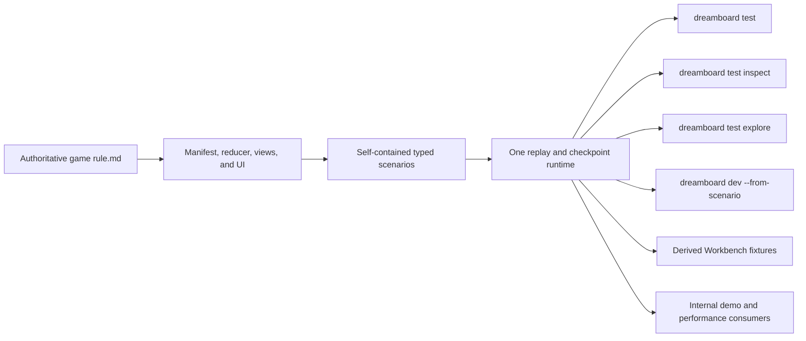

# Reference Game Rule Conformance And Agent Testing Hard Cut

Status: Phase 07 complete for local and packed-public scope; Phase 08 in
progress. Staging and production were not run.

Planned at SDK commit: `05509e395bb5b6ec28cac4b7724a649ea9e56988`

Date: 2026-07-12

Primary repositories:

- `dreamboard-sdk`: testing contracts and runtime, workspace generation,
  authoritative reference-game source, rule conformance, and derived Workbench
  inputs.
- `dreamboard`: the public `dreamboard test` and `dreamboard dev` command
  surfaces, scaffolds, and agent skill documentation.
- `internal`: immutable source admission, demo-release compilation and
  publication, browser/performance consumers, and landing-page catalog
  presentation.

Related plans:

- [Competition Game Authoring Capability Hard Cut](../competition-game-authoring-capability-hard-cut/README.md)
- [Agent-First Authoring DX And Runtime Consolidation](../agent-first-authoring-dx/README.md)
- [Reference Game Teaching Source And Admission Hard Cut](../reference-game-teaching-source-and-admission-hard-cut/README.md)
- [UI Agent Iteration Workbench](../ui-agent-iteration-workbench/README.md)
- `../internal/docs/exec-plans/browser-demo-scenario-authoring-hard-cut/README.md`

## Executive Decision

Rewrite all nine SDK reference games to conform to their approved local
`rule.md` files, and make a self-contained scenario the only durable behavior
test and authoring path.

A scenario starts a real game from normal setup, replays typed legal commands,
and asserts projected behavior. `dreamboard test inspect` and
`dreamboard test explore` are read-only JSON operations over that same replay
runtime. They help an agent discover what it can do at a checkpoint; they do
not create a second draft, recording format, state authority, or test mode.

Hard-cut the authored base-state model. Remove `defineBase`, `BaseDefinition`,
`BaseStateArtifact`, base inheritance, `ScenarioDefinition.from`, and
`game.patchState`. Remove checked-in generated state, generated workspace
files, Workbench fixtures, generated catalog source, and obsolete screenshots
after every consumer generates or materializes them on demand.

Keep each game's `pnpm-lock.yaml`. A reference game is an isolated external
consumer of the public SDK, and its lockfile is part of package provenance and
internal admission. The nine lockfiles account for only 13,681 lines, or 5.5%
of the current game roots; they are not the source-size problem.

Treat the approved rules as authority. Existing implementations and tests are
characterization evidence only and may be wrong. A passing old test cannot
override a rule, and a scenario module that merely loads successfully is not
proof that its callbacks executed.

## Relationship To Earlier Plans

- The closed Competition Game Authoring plan remains the authority for the
  framework capabilities it shipped and for the rule-brief strategy. This plan
  owns conformance of the rewritten games to those briefs.
- The closed Agent-First Authoring plan remains authoritative for bound
  authoring, typed diagnostics, observability, generated reference docs, and
  its other shipped work. This plan explicitly replaces its base-state
  fingerprint/remediation workflow and every instruction to run
  `dreamboard test generate`.
- The proposed Reference Game Teaching Source plan remains directionally
  authoritative for SDK-owned editable source and content-addressed internal
  admission. Where it expects checked generated workspace/test/Workbench
  output, this newer plan replaces that persistence model with clean-clone
  on-demand generation while retaining all nine package lockfiles.
- The UI Workbench remains a derived consumer of real game source and
  scenarios. This plan changes its checked fixture/catalog output into a local
  or CI artifact; it does not create an editable Workbench game copy.
- The internal browser-demo scenario plan may retain performance execution and
  replay-consumption goals. Its private scenario-author command language is
  superseded by the public scenario, inspect, and explore path here.

When the documents disagree on scenario shape, base-state authority,
generated-output persistence, or authoring commands, this plan is the later
implementation authority.

## Why This Plan Exists

The current reference-game roots contain 249,319 tracked lines. The majority is
derived material checked in beside authored source:

| Category                              |   Files |           Lines | Role after this plan                   |
| ------------------------------------- | ------: | --------------: | -------------------------------------- |
| Authored source, docs, and tests      |     492 |          36,378 | Keep and rewrite against `rule.md`     |
| Generated workspace files             |      76 |          92,907 | Generate on demand; never track        |
| Generated test states and projections |      76 |         103,911 | Delete; replay scenarios instead       |
| Per-game lockfiles                    |       9 |          13,681 | Keep as isolated-consumer provenance   |
| Workbench fixtures outside game roots | derived |          26,872 | Generate/cache/upload; never track     |
| Generated Workbench catalog           |       1 |             597 | Generate during build/dev; never track |
| Old Mosaic screenshots                |      11 | binary, 1.17 MB | Delete; capture named scenarios in CI  |

Generated workspace and test output alone is 196,818 lines, 79% of the game
roots. Removing those authorities is both the largest size reduction and the
largest authoring-DX improvement.

The current test surface also teaches conflicting workflows:

- public CLI source has one `dreamboard test` command that regenerates and
  executes, while generated docs still teach `test generate` and `test run`;
- tests are split between reusable bases and scenarios, and generated bases
  serialize complete table state and every player projection;
- some package scripts load exported scenario objects under `tsx --test`
  without actually invoking their callbacks;
- four newer games use shapes different from the reducer-native scenario
  runner;
- `availableInteractions` includes visible but unavailable descriptors, so its
  name cannot safely be presented to an agent as executable actions; and
- internal planning proposes a separate private scenario-author command set,
  which would create two authoring languages for the same behavior.

This plan replaces those contradictions with one runtime, one persistent test
artifact, and one agent-oriented JSON contract.

## Authority Chain



The arrows are one-way:

- runtime behavior must conform to `rule.md`;
- scenarios prove that behavior but do not redefine it;
- inspect and explore expose runtime authority but cannot mutate source;
- Workbench, browser demos, and performance workloads consume the same compiled
  scenario checkpoints; and
- no generated state, copied game, or private authoring draft becomes a second
  source of truth.

## Target Author Workflow

The agent creates or edits one TypeScript scenario. Generated types make
interaction IDs and their parameters discoverable at edit time; runtime
inspection makes the currently executable concrete choices discoverable after
setup or any prefix.

```ts
import { defineScenario } from "../testing-types.js";

export default defineScenario({
  id: "mosaic.master-share",
  description: "A master may share a space occupied by one ordinary worker.",
  setup: { players: 2, seed: 0 },
  given: [
    {
      actor: { seat: 0 },
      interactionId: "placeWorker",
      params: { workerId: "ordinary-1", spaceId: "timberYard" },
    },
  ],
  when: [
    {
      actor: { seat: 1 },
      interactionId: "placeWorker",
      params: { workerId: "master", spaceId: "timberYard" },
    },
  ],
  then(ctx) {
    ctx.expect(ctx.flow().activeActors.map(({ seat }) => seat)).toEqual([0]);
    ctx.expect(ctx.actions({ seat: 0 })).toHaveInteraction("placeWorker");
  },
});
```

The exact generated helper names are finalized in Phase 01, but the concepts
above are fixed:

- `setup` contains only a player count, safe-integer seed, and an optional
  genuine product setup profile;
- `given` is the legal replay prefix that reaches the state under test;
- `when` is the legal command sequence whose behavior is asserted;
- each command identifies an actor by stable seat, an interaction ID, and its
  typed parameters;
- `then` receives typed state/view/action/explanation/trace/outcome matchers;
- neither scenarios nor helpers patch reducer state; and
- isolated pure unit tests may construct inputs for pure scoring or selection
  functions, but they do not claim end-to-end rule conformance.

Where an approved brief says scenario setup may isolate a rare branch,
“isolate” means selecting a normal player count/profile and deterministic seed,
then writing the legal replay prefix that reaches it (or using a clearly
separate pure helper test). It does not authorize state mutation, injected
hands/decks/resources, a terminal setup profile, or another base mechanism.

A typical agent loop is:

```bash
# Inspect normal setup or the prefix already authored in `given`, as seat 0.
dreamboard test inspect test/scenarios/master-share.scenario.ts \
  --perspective player:0

# Enumerate accepted concrete next commands at that checkpoint.
dreamboard test explore test/scenarios/master-share.scenario.ts \
  --perspective player:0

# Paste one returned canonical command into `given` or `when`, then prove it.
dreamboard test --scenario test/scenarios/master-share.scenario.ts

# Materialize the exact same checkpoint in the browser when visual proof matters.
dreamboard dev \
  --from-scenario test/scenarios/master-share.scenario.ts \
  --at when:1
```

`inspect` and `explore` print one versioned semantic JSON envelope to stdout by
default. There is no `--format human`, alternate prose mode, or draft file.
They integrate with the CLI's global machine-output plumbing without nesting a
captured human transcript. Once the CLI recognizes the `test` family,
diagnostics and unexpected failures both go into one envelope on stdout with
stderr empty and an appropriate nonzero exit code. Only a bootstrap failure
before command-family recognition may use the CLI's ordinary stderr path.

## Inspect And Explore Contracts

`inspect` observes one deterministic checkpoint. It returns:

- scenario identity, setup, checkpoint, and replay fingerprint;
- current phase, step, active/pending actors, continuation waiters, blockers,
  and terminal state;
- public state plus exactly one requested player or spectator view, subject to
  normal projection;
- visible interaction descriptors with authoritative availability and reasons;
- executable actions, defined as authorized descriptors whose complete input
  domain has at least one legal assignment;
- interaction explanations, eligible input domains, diagnostics, dispatch
  traces, and consumed entropy; and
- derived causal blockers where the scheduler can prove them.

The public terms are deliberately distinct:

- an **interaction** is a descriptor visible to the selected perspective and
  may be unavailable;
- an **action** is an interaction for which trusted authorization and input
  satisfiability prove at least one legal complete parameter assignment now;
- a **concrete command** is one accepted `{ actor, interactionId, params }`
  returned by explore or authored in a scenario.

There is no aggregate `actionableActors` or `requiredActions` set. Whether the
selected actor can act is answered directly by that perspective's `actions`;
the scheduler-owned actor lists describe flow obligations, not another action
vocabulary.

The trusted input-domain layer must provide a budget-independent `hasAny`
answer before an interaction becomes an action. Bounded exploration may omit
or paginate concrete commands, but that cannot turn a real actor into a
deadlock or make an empty input domain into an action.

`explore` begins with that same checkpoint and returns bounded, deterministic
accepted successors for exactly the selected player perspective. It expands
eligible parameter domains, submits each candidate against an isolated clone,
and reports the canonical command plus a compact perspective-scoped after-state
summary. It supports explicit budgets and cursors. It never changes the
scenario, advances a durable session, combines private perspectives, or treats
a rejected submission as a valid branch.

The target envelope shape is:

```json
{
  "schemaVersion": 2,
  "ok": true,
  "command": "test.inspect",
  "result": {
    "schemaVersion": 1,
    "scenario": {
      "id": "lantern.first-pick-barrier",
      "path": "test/scenarios/first-pick-barrier.scenario.ts",
      "sourceDigest": "sha256:..."
    },
    "node": {
      "checkpoint": { "segment": "given", "completed": 1 },
      "checkpointDigest": "sha256:...",
      "perspective": {
        "kind": "player",
        "actor": { "seat": 0, "playerId": "player-1" }
      },
      "flow": {
        "phase": "drafting",
        "step": null,
        "activeActors": [
          { "seat": 1, "playerId": "player-2" },
          { "seat": 2, "playerId": "player-3" }
        ],
        "pendingActors": [
          { "seat": 1, "playerId": "player-2" },
          { "seat": 2, "playerId": "player-3" }
        ],
        "continuationWaiters": [{ "seat": 0, "playerId": "player-1" }],
        "blockedBy": [
          {
            "actor": { "seat": 0, "playerId": "player-1" },
            "blockers": [
              { "seat": 1, "playerId": "player-2" },
              { "seat": 2, "playerId": "player-3" }
            ],
            "source": "scheduler"
          }
        ]
      },
      "actions": [],
      "interactions": [],
      "diagnostics": []
    }
  },
  "nextActions": []
}
```

`blockedBy` is a diagnostic projection, not authored game state and not a new
interaction rule. It is emitted only for a causal scheduler dependency:

- a player who has committed in a simultaneous barrier is blocked by the
  remaining pending actors;
- an offeror whose continuation waits for a targeted response is blocked by
  that target;
- a turn owner waiting for mandatory discards is blocked by the remaining
  obligated actors; and
- ordinary inactive players are not reported as blocked by the current turn
  owner merely because it is not their turn.

If a nonterminal player-controlled node has no action for any active actor, the
runtime returns a typed deadlock diagnostic. It computes that condition inside
the trusted runtime without exposing a cross-perspective actionability list.
It does not guess blockers or emit `blockedBy: []` as if that explained the
state.

There is no `requiredActions`, `playerTurn.decision`, author-supplied
`blockedBy`, or second decision schema. The existing trusted interaction
decision, actor resolver, simultaneous pending set, descriptors, and
availability rules remain authoritative.

## Scenario Matrix Is Mechanic-Agnostic

Entropy is one matrix dimension, not the organizing abstraction. Each game's
ledger chooses from these dimensions:

| Dimension               | Representative states                                                      |
| ----------------------- | -------------------------------------------------------------------------- |
| Scheduler shape         | one actor, simultaneous barrier, targeted response, automatic procedure    |
| Availability transition | available, not your turn, resource-gated, rule-blocked, terminal           |
| Input domain            | scalar, choice set, ordered/multi-select, board target, dependent inputs   |
| Entropy                 | no entropy, seeded shuffle, die/coin input, random subset, recorded cursor |
| Information             | public, private hand, sealed commitment, revealed result                   |
| Persistence             | setup, mid-round, round boundary, reconnectable checkpoint, terminal       |
| Outcome                 | solo success/failure, winner, ranked result, tie, cancelled/no-contest     |

Use deterministic seeds and recorded entropy traces to find ordinary branches.
Do not add a dice-only matrix or exact-outcome queue. If seed discovery proves
inadequate across more than one game family, stop and design one generic
entropy-testing capability rather than adding game-specific overrides.

## Canonical Game Migration Matrix

All directory IDs, package names, reference-game IDs, and `demoRelease.slug`
values remain stable. They are machine and route identities. Display names,
copy, UI, and assets use the approved themes.

| Directory ID                   | Approved display name | Primary conformance burden                                             | Owning phase |
| ------------------------------ | --------------------- | ---------------------------------------------------------------------- | -----------: |
| `roll-and-write-scorecard`     | Cloudline Survey      | per-player grid, seeded dice, complete survey                          |           02 |
| `simultaneous-card-drafting`   | Lantern Market        | simultaneous sealed choice and reveal barrier                          |           03 |
| `solo-countdown-puzzle`        | Last Light            | countdown, deterministic automatic procedures, solo outcome            |           03 |
| `hex-network-trading`          | Stormtrail            | network building, resource economy, roll-seven discard, targeted trade |           03 |
| `multiplayer-ranking-and-ties` | Harbor Fair           | ranked outcomes, ties, breakdowns, cancelled result                    |           04 |
| `automa-river-rival`           | River Guild           | deterministic non-seat rival, events, six-round cooperative arc        |           04 |
| `hearts`                       | Hearts                | hidden hands, passing barrier, follow suit, one-hand scoring           |           05 |
| `deck-building-market`         | Sketchbook            | market, draw/discard/reshuffle, purchase economy, terminal scoring     |           05 |
| `worker-placement-tableau`     | Mosaic Workshop       | worker placement, blocking, tableau/season progression, final scoring  |           05 |

Every game gets `test/scenarios/complete-game.scenario.ts` from normal setup to
an authoritative terminal outcome. These are useful product demos, not merely
one-turn test fixtures. Focused branch scenarios supplement the complete arc.
The product may select a smaller landing-page set, but the SDK does not encode
that selection as game behavior or maintain demo-only game copies.

## Ownership And Cross-Repository Boundaries

| Concern                                                  | Owner                        | Rule                                                                                   |
| -------------------------------------------------------- | ---------------------------- | -------------------------------------------------------------------------------------- |
| Rule and editable game implementation                    | SDK game workspace           | One source under `examples/reference-games/<id>/`                                      |
| Scenario schema, replay, checkpoint, inspect/explore DTO | SDK testing/runtime packages | No CLI-only behavior model                                                             |
| Public commands, JSON envelope, templates, skill docs    | `dreamboard` CLI app         | `packages/cli-core` remains portable and does not absorb full CLI/runtime concerns     |
| Workbench fixture derivation                             | SDK tooling                  | Generated on demand from canonical scenarios                                           |
| Source/package admission                                 | `internal`                   | Continues verifying each game package and lockfile against exact public SDK provenance |
| Demo compilation/publication                             | `internal`                   | Consumes admitted SDK source; no editable copy                                         |
| Browser/performance replay                               | `internal`                   | May consume compiled scenarios; may not own a second scenario-author format            |
| Landing selection and media presentation                 | `internal` product           | Consumes catalog metadata and packaged thumbnail URL                                   |

The proposed internal private scenario-author workflow is superseded wherever
it overlaps authoring. `tools/perf` may retain workload orchestration and
browser measurement, but scenario creation, discovery, checkpointing, and
replay belong to the public scenario/test path.

Internal admission currently requires each selected game's `package.json` and
`pnpm-lock.yaml`, resolves the exact public SDK from that lock, and includes
both in provenance. Phase 07 preserves that contract. Lockfile deletion or
consolidation is not part of this plan.

## Phases

| Phase | Title                                                                                                      | Primary exit                                                                                                           |
| ----: | ---------------------------------------------------------------------------------------------------------- | ---------------------------------------------------------------------------------------------------------------------- |
|    00 | [Authority, baseline, and conformance ledger](phase-00-authority-baseline-and-conformance-ledger.md)       | Decisions, consumers, deletions, and every rule obligation are mapped                                                  |
|    01 | [Base-free scenario runtime hard cut](phase-01-base-free-scenario-runtime-hard-cut.md)                     | One scenario schema/replay runtime exists without base-state authority                                                 |
|    02 | [JSON inspect/explore and Cloudline pilot](phase-02-json-inspect-explore-and-cloudline-pilot.md)           | Public agent loop works vertically on a complete seeded game                                                           |
|    03 | [Scheduler-shape pilots](phase-03-scheduler-shape-pilots.md)                                               | Simultaneous, automatic, targeted-response, and discard barriers are proven                                            |
|    04 | [Outcome and automa pilots](phase-04-outcome-and-automa-pilots.md)                                         | Ranked/tied/cancelled and deterministic-rival arcs conform                                                             |
|    05 | [Remaining adapted-game conformance](phase-05-remaining-adapted-game-conformance.md)                       | Hearts, Sketchbook, and Mosaic Workshop conform through complete games                                                 |
|    06 | [On-demand artifacts and public release checkpoint](phase-06-derived-artifact-and-source-size-hard-cut.md) | Local consumers generate on demand; private consumer pretests the contract; exact SDK is public and locks are repinned |
|    07 | [Workbench, demo, deletion, and cross-repo cutover](phase-07-workbench-demo-and-cross-repo-cutover.md)     | Internal proves a real deletion-candidate commit; the identical hard cut lands; all nine demos pass locally            |
|    08 | [Docs, release, and merge closeout](phase-08-docs-release-and-merge-closeout.md)                           | Frozen releases/pins, docs/help, CI, receipts, and PR state are verified                                               |

Execution order is strictly `00 -> 01 -> 02 -> 03 -> 04 -> 05 -> 06 -> 07 -> 08`.
Phases 01 and 02 establish the contract before games migrate. Phase 06 rewires
local consumers, pretests the replay contract with its private consumer, and
publishes the exact SDK/lock provenance but deliberately keeps tracked derived
files. Phase 07 proves internal compilation from a real disposable
deletion-candidate commit, lands the identical derived-free tree, then repeats
ordinary Git-archive admission. Phase 08 verifies the frozen release and claims
merge completion.

## Deletion Ledger

The following are required end states, with deletion delayed until the named
replacement is green:

| Delete or reject                                                        | Replacement prerequisite                                                            |
| ----------------------------------------------------------------------- | ----------------------------------------------------------------------------------- |
| `packages/sdk` testing base contracts and runtime                       | Base-free scenario replay passes SDK and packed-consumer tests                      |
| `examples/reference-games/*/test/bases/**`                              | Equivalent rule-conformance scenarios replay normal setup                           |
| `examples/reference-games/*/test/generated/**`                          | Test/dev/fixture consumers use transient checkpoints or ignored fingerprinted cache |
| Test-only setup profiles                                                | Legal replay reaches the branch; ordinary product profiles remain                   |
| Checked workspace-codegen-owned files under each game's `shared/`       | All build/dev/test/pack/demo entrypoints run standard generation first              |
| `fixtures/ui/reference-games/**`                                        | Workbench compiles on demand and determinism is proven in temp directories          |
| `packages/ui-workbench/src/catalog.ts` if generated                     | Workbench build/dev generates its catalog                                           |
| Mosaic `test/screenshots/*.png`                                         | Named UI scenario capture is an uploaded CI artifact                                |
| Private internal scenario-author commands and draft schema              | Public scenario inspect/explore/replay covers their authoring job                   |
| Stale docs teaching `test generate`, `test run`, bases, or prose output | Generated reference, CLI help, and skill docs describe the one path                 |

Do **not** delete:

- `examples/reference-games/*/pnpm-lock.yaml`;
- genuine player-facing setup profiles;
- authored rules, reducer/UI source, or conformance scenarios; or
- stable directory IDs, package names, game IDs, and demo slugs.

## Source-Size Budgets

Phases 06-07 record exact before/after receipts, and Phase 07 enforces these
structural budgets:

- zero tracked workspace-codegen-owned output in reference-game workspaces;
- zero tracked `test/generated/**` or `test/bases/**` files;
- zero tracked compiled Workbench reference-game fixtures or generated catalog;
- zero obsolete local Playwright screenshots;
- exactly one lockfile per isolated game workspace; and
- at most 75,000 tracked lines across the nine game roots, including rules,
  authored tests, UI, and all nine lockfiles, unless a reviewed receipt proves
  why authored gameplay—not generated duplication—requires an increase.

The pre-rewrite projection was about 48,701 lines including lockfiles. The
integrated Phase 07 tree is 47,475 lines across 526 tracked game-root paths,
including 13,681 lock lines. The 75,000-line ceiling leaves room for complete
games while preventing a return to a quarter-million-line teaching corpus.

## Hard-Cut Invariants

1. `rule.md` is authoritative; old source and tests are evidence, not an oracle.
2. One self-contained scenario is the only persistent behavior-test format.
3. Setup plus legal replay replaces bases, snapshots, inheritance, state patching,
   and test-only game profiles.
4. Visible interactions are not necessarily executable actions; authorization
   plus a budget-independent nonempty complete input domain makes an
   interaction an action.
5. There is no authored required-action list, decision field, or blocker map.
6. Blockers and deadlocks are derived diagnostics from scheduler and interaction
   authority, not new game concepts.
7. Test, inspect, and explore produce stable semantic JSON for agents; no human
   format flag or prose parsing is added. Inspect/explore require one explicit
   player or spectator perspective and never aggregate private views.
8. The scenario matrix covers scheduler, inputs, entropy, information, and
   outcomes; it is not designed around dice or any single game.
9. Generated output is reproducible evidence, never checked-in source authority.
10. Per-game lockfiles remain isolated-consumer provenance.
11. Stable machine IDs and public slugs remain unchanged; only display/theme
    surfaces are renamed.
12. Every game proves a complete normal-setup arc, and every browser/demo
    consumer materializes that same scenario model.

## Deliberate Exclusions

- No general search planner, game-playing AI, or optimal-move engine.
- No authored `requiredActions`, `playerTurn.decision`, or `blockedBy` schema.
- No dice-specific matrix, exact-roll queue, or game-specific entropy override.
- No direct reducer-state mutation, SQL-like test fixture language, or reusable
  snapshot/base hierarchy.
- No permanent inspected checkpoint files. An ignored, fingerprinted local
  cache is allowed only as a performance optimization.
- No second private scenario-author workflow in `internal`.
- No rename of persistent IDs/slugs and no route/storage migration.
- No landing-page product selection contract in SDK game behavior.
- No staging or production mutation as a prerequisite for source closure unless
  the release owner explicitly requests it; exact packed and local integration
  proof is required.

## Definition Of Done

The plan is source-closed only when:

- all nine `rule.md` acceptance obligations map to passing scenarios or
  explicitly named pure unit tests, with no inherited old-test authority;
- all nine games complete from normal setup to an authoritative terminal result;
- `dreamboard test`, `test inspect`, `test explore`, and
  `dev --from-scenario` use one replay/checkpoint runtime;
- the JSON schemas, stable error codes, cursors, budgets, blocker derivation,
  perspective isolation, structured entropy traces, input satisfiability, and
  deadlock behavior are contract-tested;
- no base contract, checked base snapshot, state patch hook, test-only setup
  profile, or stale generated-test instruction remains;
- all generated workspace and Workbench output is on-demand, deterministic,
  ignored, and rejected if tracked;
- each game remains an independently installable packed consumer with its own
  lockfile resolved to the exact admitted public SDK;
- internal demo release and performance consumers use admitted canonical
  scenarios, not copied games or a private authoring format;
- full-game browser materialization works for all nine, landing cards use
  packaged thumbnail URLs, and no broken hard-coded demo image path remains;
- generated references, CLI help, public agent skill docs, READMEs, and plan
  closeout receipts agree on the single workflow;
- the exact SDK and CLI release train is published/repinned where required and
  packed integration lanes pass; and
- all affected repositories are clean, their branches are pushable, CI is
  green, and the PRs report no merge conflicts.

Local SDK success is not merge completion. Phase 08 records separate SDK,
public CLI, and internal receipts and names any live-environment proof that was
not requested or performed.

## Global STOP Conditions

Stop the implementation and return to design review if any phase would require:

- changing an approved `rule.md` to make current code or tests pass;
- adding an author-maintained decision, required-action, blocker, or second
  availability model;
- exposing private information through inspect/explore or using omniscient data
  to enumerate a player's actions;
- patching state or adding a test-only setup profile to avoid legal replay;
- creating a dice-only or game-specific framework primitive;
- deleting/consolidating per-game lockfiles before internal package provenance
  has a reviewed replacement;
- deleting generated output before every consumer can regenerate from a clean
  clone and exact packed dependency;
- renaming a stable game ID or demo slug without an explicit route, release,
  workload, and storage migration plan; or
- retaining a private scenario-author format because one downstream consumer
  has not migrated.

When a stop condition fires, record the exact game, rule obligation, command,
checkpoint, and missing generic capability. Do not hide the gap with a fixture,
compatibility shim, or weaker assertion.
