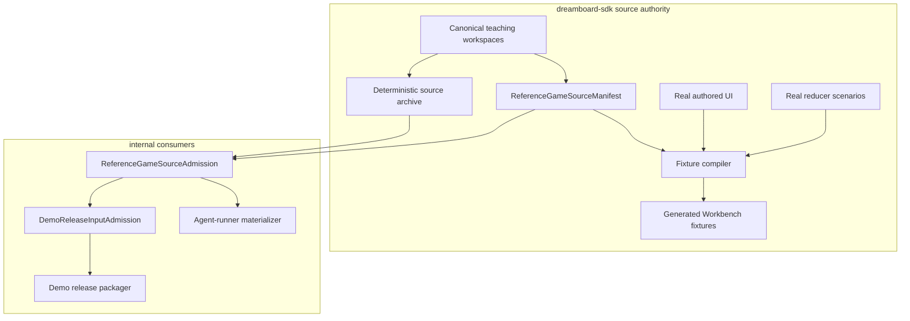

# Reference Game Teaching Source And Admission Hard Cut

Status: proposed implementation handoff

Planned at SDK commit: `7b6dcb5e310b8930aa44300bb71358cf5510a34a`

Date: 2026-06-19

Primary repositories:

- `dreamboard-sdk`: authoritative reference-game source, source manifest,
  Workbench fixture derivation, and public contract.
- `internal`: immutable source admission, demo-release consumption, and
  agent-runner materialization.

Related plans:

- [UI Agent Iteration Workbench](../ui-agent-iteration-workbench/README.md)
- [UI Primitive Coverage And Agent Loop](../ui-primitive-coverage-and-agent-loop-hard-cut/README.md)
- [Competition Game Authoring Capability Hard Cut](../competition-game-authoring-capability-hard-cut/README.md)
- `../internal/docs/exec-plans/demo-release-input-admission-and-sdk-authority-hard-cut/`

## Executive Decision

Make each SDK reference game one standalone, playable teaching workspace. The
workspace root is the only editable implementation of the manifest, reducer,
views, UI, and behavior scenarios.

Use the same content-addressed framework as demo release, but split the
contracts by ownership:

1. `ReferenceGameSourceManifest` is SDK-owned. It identifies the exact source
   objects, teaching metadata, entrypoints, and per-game package provenance.
   Its `bundleDigest` is content identity and does not include a Git revision.
2. `ReferenceGameSourceAdmission` is internal release-tooling-owned. It binds
   one immutable source archive to an exact SDK npm artifact and records
   successful workspace verification.
3. `DemoReleaseInputAdmission` references the admitted reference source. It
   does not independently clone, archive, or identify reference-game source.
4. Agent-runner consumes the same admitted source and materializes teaching
   workspaces. It does not vendor runner-owned editable examples.
5. Workbench fixtures are derived proof artifacts that record the SDK source
   manifest digest. They are not an editable game implementation.

The final source path is:

```text
examples/reference-games/<game-id>/
  README.md
  reference-game.json
  package.json
  pnpm-lock.yaml
  rule.md
  manifest.ts
  manifest.tsconfig.json
  app/
  ui/
  shared/
  test/
    scenarios/
    ui-scenarios/
  assets/
```

Delete these legacy source authorities:

```text
examples/reference-games/*/demo-workspace/
examples/reference-games/*/src/reference-game.mjs
examples/reference-games/*/src/ui.mjs
examples/reference-games/*/src/scenarios/
examples/reference-games/*/scenarios/coverage.json
examples/reference-games/*/scenarios/verify.mjs
examples/reference-games/shared/reference-reducer.mjs
examples/reference-games/shared/reference-ui.mjs
```

Do not replace them with an editable `workbench/` directory. Workbench receives
generated fixture modules under `fixtures/ui/reference-games/`.

## Problem

The repository currently teaches and proves different implementations.

| Concern                 | Current source                                                                              |
| ----------------------- | ------------------------------------------------------------------------------------------- |
| Rich authored game      | `examples/reference-games/<id>/demo-workspace/` for five games                              |
| Fixture reducer model   | `examples/reference-games/<id>/src/reference-game.mjs`                                      |
| Fixture UI              | `examples/reference-games/<id>/src/ui.mjs`                                                  |
| Fixture scenario        | `examples/reference-games/<id>/src/scenarios/*.scenario.mjs` plus `scenarios/coverage.json` |
| Packed consumer         | Root package scripts that execute only the fixture model                                    |
| Demo source             | `demoRelease.sourcePath` pointing at `demo-workspace/`                                      |
| Agent teaching examples | Internal runner-owned `examples/published/*` slugs                                          |

The current generic fixture reducer is still synthesized from reference
metadata in
`examples/reference-games/shared/reference-reducer.mjs`. It does not execute
the authored reducer in `app/game.ts`. The fixture compiler also imports the
separate `src/ui.mjs` renderer.

The split is especially visible in the four newer canonical games:

| Game                           | Authored workspace state                              |
| ------------------------------ | ----------------------------------------------------- |
| `roll-and-write-scorecard`     | Scenario skeleton; executable game lives under `src/` |
| `multiplayer-ranking-and-ties` | Scenario skeleton; executable game lives under `src/` |
| `solo-countdown-puzzle`        | Placeholder                                           |
| `automa-river-rival`           | Placeholder                                           |

The existing `reference-games:check` passes because it validates the legacy
fixture package shape. Passing that command does not prove that every canonical
example is a complete teaching workspace.

## Target Architecture



The source manifest and source archive are siblings:

- `bundleDigest` identifies the canonical manifest payload and its object
  inventory. The same bytes produce the same digest in an authoring snapshot
  and an exact Git materialization.
- `archiveSha256` identifies the deterministic tar bytes.
- The archive digest is recorded by admission rather than embedded in the
  manifest payload, avoiding a manifest-inside-archive digest cycle.
- Workbench may compute a manifest from one frozen active-worktree snapshot,
  but that manifest has `provenance.kind: "worktree"` and claims no revision.
- Internal admission accepts only a manifest and archive materialized from
  exact Git objects with `provenance.kind: "git"`.

## Contract Hierarchy

### SDK-owned source manifest

Target public subpath:

```text
@dreamboard-games/sdk/reference-games
```

Target exports:

```ts
export {
  REFERENCE_GAME_SOURCE_MANIFEST_SCHEMA_VERSION,
  computeReferenceGameSourceDigest,
  parseReferenceGameSourceManifest,
  type ReferenceGameSourceManifest,
  type ReferenceGameSourceManifestPayload,
};
```

The manifest identifies source content. It does not claim that an internal
release or an agent-runner deployment admitted the source. Provenance is
outside the canonical payload, so it cannot create a pre-commit digest cycle.

### Internal source admission

Target private subpath:

```text
@dreamboard/release-contract/reference-game-source-admission
```

Target exports:

```ts
export {
  computeReferenceGameSourceAdmissionDigest,
  parseReferenceGameSourceAdmission,
  type ReferenceGameSourceAdmission,
  type ReferenceGameSourceAdmissionPayload,
};
```

Admission binds:

- full public SDK Git SHA;
- source manifest digest;
- deterministic archive SHA-256;
- exact SDK npm version, integrity, and tarball SHA-256;
- per-game package and lockfile identity;
- successful frozen install, typecheck, reducer tests, UI tests, and required
  Workbench proof.

### Demo-release reference

`DemoReleaseInputAdmission` gains a reference to the source admission:

```ts
type ReferenceGameSourceAdmissionRef = {
  admissionDigest: `sha256:${string}`;
  bundleDigest: `sha256:${string}`;
  sourceRevision: string;
  manifestSha256: string;
  archiveSha256: string;
};
```

Demo release still owns compilation, final-bundle admission, presentation
assets, object inventory, publication, activation, and production promotion.
Those deployment concerns do not enter the SDK source manifest.

## Target Per-Game Manifest

Extend `reference-game.json` so entrypoints and teaching metadata are
machine-readable:

```json
{
  "schemaVersion": 2,
  "id": "hearts",
  "displayName": "Hearts",
  "workspace": {
    "manifest": "manifest.ts",
    "reducer": "app/game.ts",
    "ui": "ui/index.tsx",
    "behaviorScenarios": [
      "test/scenarios/pass-three.scenario.ts",
      "test/scenarios/play-trick.scenario.ts"
    ],
    "uiScenarios": ["test/ui-scenarios/pass-three.mobile.scenario.ts"]
  },
  "teaching": {
    "whatThisTeaches": [
      "private player views",
      "simultaneous card passing",
      "follow-suit legality"
    ],
    "readFirst": [
      "rule.md",
      "manifest.ts",
      "app/game.ts",
      "app/phases/passing/index.ts",
      "ui/App.tsx",
      "test/scenarios/pass-three.scenario.ts"
    ]
  },
  "publishToDemoGallery": true,
  "mechanics": [
    "trick-taking",
    "simultaneous-card-passing",
    "hidden-information"
  ],
  "uiPatterns": [
    "private-hand",
    "multi-select",
    "mobile-hand-actions",
    "shared-trick-area"
  ]
}
```

`workspace.ui` is the only UI entrypoint. Demo screenshots, fixture rendering,
and agent teaching all consume it. Do not repeat the path under
`demoRelease.screenshot.projection`.

## Hard-Cut Invariants

1. Every canonical reference game is a complete standalone workspace.
2. A game has one reducer, one projection model, one UI tree, and one behavior
   scenario model.
3. Workbench scenario modules may select a real scenario and provide browser
   replay instructions. They may not define game rules, state, projections, or
   replacement UI.
4. Fixture compilation executes the real authored reducer bundle and imports
   the real authored UI entrypoint.
5. Packed verification runs the workspace's real typecheck and tests.
6. Authoring compilation uses one frozen worktree snapshot and records only
   its content digest. Release admission rematerializes the same content from
   exact Git objects and is the only layer allowed to bind a revision.
7. Internal consumers receive one immutable source admission. They do not
   resolve the SDK repository independently.
8. Demo release and agent-runner record the same source admission digest.
9. Agent-runner has no hardcoded example slugs and no private
   `examples/published` fallback.
10. No compatibility fallback remains after cutover.

## Repository Ownership

| Concern                                     | Owner                                                    | Must not own                                          |
| ------------------------------------------- | -------------------------------------------------------- | ----------------------------------------------------- |
| Editable reference game                     | `dreamboard-sdk/examples/reference-games/<id>`           | Internal editable copy                                |
| Source manifest and canonical source digest | `@dreamboard-games/sdk/reference-games`                  | Demo deployment policy                                |
| Workbench fixture compiler                  | `dreamboard-sdk/scripts/ui-fixtures`                     | Alternative game reducer or UI                        |
| Immutable source admission                  | Internal `packages/release-contract` plus admission tool | Editable game source                                  |
| Demo release compilation and activation     | Internal demo-release toolchain                          | Independent source checkout                           |
| Agent workspace placement and selection     | Internal agent-runner                                    | Source content or runner-specific SDK manifest fields |

## Delivery Phases

| Phase                                                              | Name                                             | Primary result                                                                   |
| ------------------------------------------------------------------ | ------------------------------------------------ | -------------------------------------------------------------------------------- |
| [00](phase-00-decision-freeze-and-characterization.md)             | Decision freeze and characterization             | Freeze terminology, capture dual-source behavior, and block accidental expansion |
| [01](phase-01-source-manifest-and-deterministic-bundle.md)         | Source manifest and deterministic bundle         | SDK-owned content identity plus exact-Git release materialization                |
| [02](phase-02-real-workspace-scenario-and-fixture-compiler.md)     | Real workspace scenario and fixture compiler     | Fixture compiler can execute actual reducers and render actual UI                |
| [03](phase-03-all-game-workspace-migration-and-legacy-deletion.md) | All-game workspace migration and legacy deletion | All nine games use one root workspace and legacy authorities are deleted         |
| [04](phase-04-source-admission-and-proof-linkage.md)               | Source admission and proof linkage               | Internal admission binds source, exact SDK package, and verification             |
| [05](phase-05-demo-release-consumption-hard-cut.md)                | Demo-release consumption hard cut                | Demo release consumes the shared admission and root workspace                    |
| [06](phase-06-agent-runner-teaching-bundle-hard-cut.md)            | Agent-runner teaching-bundle hard cut            | Runner materializes admitted SDK examples without hardcoded slugs                |
| [07](phase-07-ci-docs-and-closeout.md)                             | CI, documentation, and closeout                  | Deletion guards and cross-repo gates make the cut permanent                      |

## Dependency Order

```text
Phase 00
  -> Phase 01
  -> Phase 02
  -> Phase 03
       -> Phase 04
            -> Phase 05
            -> Phase 06
  -> Phase 07 after Phases 05 and 06
```

Phase 02 may land as unused compiler capability. Phase 03 is the coordinated
source cutover. Do not merge a state where some canonical games use the new
workspace compiler and others still use the legacy fixture model.

## Cross-Repository Merge Rule

The cutover is one release train:

1. SDK source manifest and compiler APIs land.
2. All nine SDK games migrate and the SDK publishes an exact prerelease.
3. Internal release-contract and source-admission tooling repin to that exact
   SDK package.
4. Demo release and agent-runner switch to the admitted source.
5. Internal legacy example paths and source-ref fallbacks are deleted.

Do not activate Phase 05 or Phase 06 against an SDK source branch that has not
published the exact package recorded by admission.

## Verification Matrix

SDK gates:

```sh
mise exec node@24 -- pnpm reference-games:check
mise exec node@24 -- pnpm reference-games:test:packed --required
mise exec node@24 -- pnpm ui:fixtures:check
mise exec node@24 -- pnpm ui:catalog:check
mise exec node@24 -- pnpm ui:runtime:test
mise exec node@24 -- pnpm ui:test --required
mise exec node@24 -- pnpm ui:hard-cut:check
mise exec node@24 -- pnpm docs:check
mise exec node@24 -- pnpm check
```

Internal gates:

```sh
pnpm --dir packages/release-contract test
pnpm --dir packages/release-contract build
pnpm --filter @dreamboard/agent-runner test:unit
pnpm staging:demo-release:test
pnpm check:demo-release-input-authority
pnpm fin
pnpm verify:dev
```

Required cross-repo proofs:

- materialize one source admission twice from the same Git SHA and compare
  canonical payloads plus archive SHA-256;
- compile the required Workbench set from the admitted source digest;
- build a Hearts demo release from the same admission;
- prepare an agent workspace containing SDK-owned examples from the same
  admission;
- confirm all three receipts record one `bundleDigest`.

## Explicitly Rejected Designs

### Keep `workbench/` as a thin editable adapter

Rejected because it preserves a second reducer/UI representation and relies on
review discipline to prevent drift.

### Make demo release the source-manifest owner

Rejected because most canonical teaching examples are not deployment demos and
Workbench must not depend on private deployment contracts.

### Make agent-runner clone the SDK repository

Rejected because mutable refs and active worktrees reintroduce
time-of-check/time-of-use races.

### Copy all files and trust the archive hash only

Rejected because consumers also need a canonical per-game inventory,
entrypoints, teaching metadata, and package provenance.

### Preserve a fallback to `examples/published`

Rejected because the fallback becomes a permanent shadow source and allows
production to silently bypass SDK authority.

## Plan Completion

This plan is complete only when:

1. all nine canonical examples are complete root workspaces;
2. the legacy source paths listed above do not exist;
3. Workbench fixtures execute real authored reducer scenarios and real UI;
4. packed verification covers the teaching workspace rather than a fixture
   sidecar package;
5. one content-addressed SDK source manifest identifies all game source;
6. internal source admission binds that source to one exact public SDK
   artifact;
7. demo release and agent-runner consume the same admission digest;
8. demo release no longer resolves public source independently;
9. agent-runner no longer owns example slugs or private example source;
10. static guards reject reintroduction of every deleted path and fallback.
