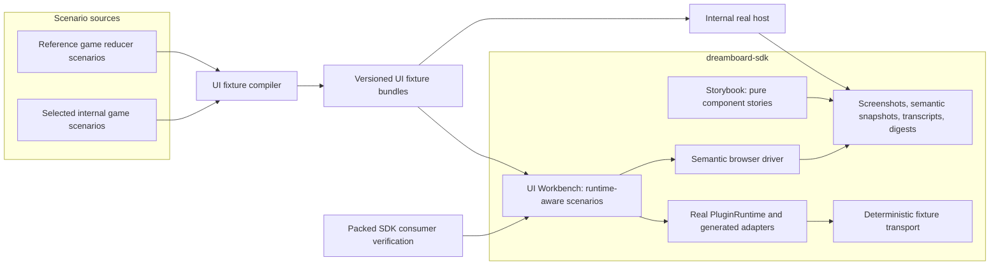
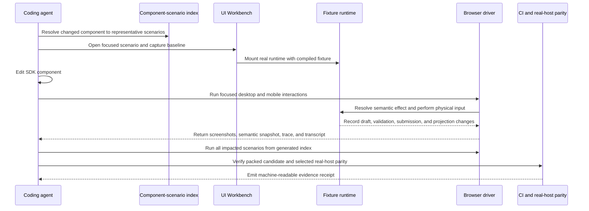

# UI Agent Iteration Workbench And Reference Games

Status: proposed on 2026-06-16.

## Executive decision

Build a deterministic UI Workbench beside Storybook, backed by the real SDK
runtime and generated UI contract. Coding agents must be able to change an SDK
component, replay representative game interactions, and verify desktop, mobile,
drag, accessibility, semantic, and visual behavior without building or running
the source games.

Storybook remains the fast environment for pure presentational components. It
does not become a game-runtime emulator.

Move the authoritative, public-safe reference game source into this repository
under `examples/reference-games/`. Treat those games as isolated consumers of a
packed SDK, not workspace packages and not public demos. Compile their real
reducer scenarios into portable UI fixture bundles consumed by the Workbench.
The internal repository consumes an immutable export of the same reference
games and fixtures for selected real-host parity checks.

This is a hard-cut design. Once every reference game has migrated, delete the
duplicated game UI wrappers and deprecated SDK authoring APIs instead of
maintaining two permanent paths.

## Why this plan

The current test surfaces answer different, incomplete questions:

- Storybook proves controlled component behavior but intentionally excludes
  `PluginRuntime`, generated `UI.Root`, surface adapters, draft state, and
  interaction routes.
- The internal examples exercise real authored UI, but agents must understand
  and build whole games before they can improve a component.
- Existing drag stories dispatch low-level pointer events but do not prove the
  physical desktop and mobile gestures used by a generated game UI.
- The internal browser verification lane proves the full stack, but it is too
  slow and operationally broad to be the primary component iteration loop.
- Visual baseline declarations exist, but there is no canonical test suite
  consuming them as an enforced component contract.

The missing layer is a runtime-aware, deterministic component laboratory that
uses production adapters and representative game state while replacing only
the host transport.

This plan builds on the generated contract and authoring boundaries established
by the
[Agent-First Authoring DX plan](../agent-first-authoring-dx/README.md). It does
not reopen those package ownership decisions.

## Target architecture



The fixture boundary is projected plugin state, source identity, replay
instructions, and expected observable digests. It must never serialize hidden
canonical reducer state and pretend to be the authority.

## Test surface boundaries

| Surface          | Purpose                                             | Uses real runtime | Builds source games            | Primary confidence                                                 |
| ---------------- | --------------------------------------------------- | ----------------- | ------------------------------ | ------------------------------------------------------------------ |
| Storybook        | Pure UI states and local interactions               | No                | No                             | Component rendering and controlled props                           |
| UI Workbench     | Generated UI in deterministic game-shaped scenarios | Yes               | No, consumes compiled fixtures | Runtime integration, responsive layout, gestures, semantic effects |
| Packed consumer  | Install candidate SDK exactly as users do           | Yes               | Reference fixture only         | Package exports, peer dependencies, build output                   |
| Real-host parity | Replay selected fixtures in the internal host       | Yes               | Yes, in the owning repo        | Host transport, browser shell, end-to-end parity                   |

## End-to-end agent iteration flow

The normal agent loop must work from a fresh SDK checkout without the internal
repository, game authority services, or source reducer build.



The concrete flow is:

1. The agent queries `component-scenario-index.json` using the changed export,
   interaction capability, or CSS token.
2. The agent opens one focused Workbench scenario and captures the committed
   semantic and visual baseline before editing.
3. The Workbench mounts the real `PluginRuntime`, generated UI contract,
   surface adapters, draft store, and authored component tree with a
   deterministic fixture transport.
4. The agent changes the SDK component without modifying a game.
5. The focused test uses real mouse, keyboard, or touch input. It resolves the
   target through the SDK semantic browser-interaction protocol rather than
   labels, text, DOM structure, or ad hoc selectors.
6. The runtime records candidate mutations, validation, submit calls,
   projection digests, actuator graph changes, focus order, and layout state.
7. The agent runs the generated impacted-scenario matrix across desktop and
   mobile viewports. Visual assertions are paired with semantic snapshots and
   command transcripts.
8. The candidate SDK is packed and installed into an isolated consumer before
   release proof is accepted.
9. CI replays a smaller golden set in the internal real host and compares
   projection, actuator, draft, submission, and final semantic digests.
10. The run writes an evidence receipt that another agent or reviewer can
    inspect without replaying the entire session.

Target commands:

```bash
# Pure component iteration.
pnpm ui:storybook

# Open one runtime-aware scenario.
pnpm ui:workbench --scenario hearts.pass-three.mobile

# Run one scenario through all required interaction assertions.
pnpm ui:test --scenario hearts.pass-three.mobile

# Resolve and run scenarios affected by the current diff.
pnpm ui:test:changed --base origin/main

# Verify the packed SDK in an isolated consumer.
pnpm ui:test:packed

# Run the selected cross-repo real-host parity lane.
pnpm ui:test:parity --scenario hearts.pass-three.mobile

# Run the complete SDK-owned UI gate.
pnpm ui:check
```

Example evidence receipt:

```json
{
  "schemaVersion": 1,
  "sdkCommit": "f2e8c12",
  "packedArtifactSha256": "sha256:...",
  "changedExports": ["HandView", "CardDropTarget"],
  "scenarios": [
    {
      "id": "hearts.pass-three.mobile",
      "projects": ["chromium-desktop", "chromium-touch-phone"],
      "semanticDigest": "sha256:...",
      "projectionDigest": "sha256:...",
      "submissionDigest": "sha256:...",
      "screenshots": ["artifacts/hearts.pass-three.mobile.phone.png"],
      "trace": "artifacts/hearts.pass-three.mobile.trace.zip",
      "result": "passed"
    }
  ]
}
```

## Reference game naming and legal boundary

Reference game IDs describe mechanics and UI patterns. They must not depend on
third-party product names for agent discovery. This migration plan identifies
the existing internal `sushi-go` path only so the implementation team can
remove it; that name must not carry into the new public reference source.

| Current internal source | Target reference ID        | Primary UI patterns                                                     |
| ----------------------- | -------------------------- | ----------------------------------------------------------------------- |
| `hearts`                | `hearts`                   | Hidden information, passing cards, trick selection, mobile hand actions |
| `frontier-trails`       | `hex-network-trading`      | Hex board, network placement, resource hand, trading panel              |
| `sketchbook`            | `deck-building-market`     | Market rows, card purchase, hand actions, repeated turns                |
| `artisans-guild`        | `worker-placement-tableau` | Worker targets, tableau cards, resource forms, modal confirmation       |
| `sushi-go`              | No direct move             | Replace with an original `simultaneous-card-drafting` fixture           |

`hearts` remains a valid identifier because it describes a traditional game.
All source code, prose, icons, card art, and fixture data still need independent
provenance. The repository must not copy commercial rule text, branded assets,
or distinctive expression from third-party games.

Reference games are source-only conformance fixtures:

- They are not registered in the public demo gallery.
- They are not marketing demos.
- Their manifests set `publishToDemoGallery` to `false`.
- Real designer games remain the only intended content for the product demo
  page.

## Repository ownership

| Repository       | Owns                                                                                                                                         | Must not own                                               |
| ---------------- | -------------------------------------------------------------------------------------------------------------------------------------------- | ---------------------------------------------------------- |
| `dreamboard-sdk` | UI components, Storybook, fixture schema/runtime, Workbench, browser drivers, public-safe reference source, fixture bundles, fast UI CI      | Internal host implementation or production game deployment |
| `internal`       | Fixture compilation from private scenarios, immutable reference export consumption, real-host parity, demo deployment of real designer games | A divergent editable copy of SDK reference games           |
| Public CLI       | Optional documentation links and future author-facing fixture commands                                                                       | A second fixture schema or browser automation protocol     |

The SDK repository is authoritative for the reference games after Phase 01.
The internal repository receives a generated export pinned by SDK commit and
content digest. Edits flow one way.

## Delivery phases

| Phase                                                                     | Primary owner                                              | Depends on                | Outcome                                                                                        |
| ------------------------------------------------------------------------- | ---------------------------------------------------------- | ------------------------- | ---------------------------------------------------------------------------------------------- |
| [Phase 00](./phase-00-decision-freeze-and-executable-baseline.md)         | SDK UI and test tooling                                    | None                      | Freeze contracts, repair the current UI test baseline, and make visual coverage executable     |
| [Phase 01](./phase-01-reference-game-ownership-and-consumer-boundary.md)  | SDK reference games, internal integration, rights reviewer | Phase 00 decisions        | Move public-safe reference source into the SDK with mechanic names and isolated consumer rules |
| [Phase 02](./phase-02-portable-ui-scenario-fixture-contract.md)           | SDK runtime/testing and internal scenario tooling          | Phase 01 source ownership | Define and compile portable, versioned UI scenario fixtures                                    |
| [Phase 03](./phase-03-deterministic-fixture-runtime.md)                   | SDK runtime                                                | Phase 02 schema           | Run fixtures through the real SDK runtime with deterministic host transport                    |
| [Phase 04](./phase-04-ui-workbench-and-agent-catalog.md)                  | SDK developer tooling                                      | Phases 02-03              | Deliver the agent-facing Workbench, scenario catalog, and evidence receipts                    |
| [Phase 05](./phase-05-browser-gesture-visual-and-accessibility-matrix.md) | SDK UI/runtime and browser automation                      | Phase 04 Workbench        | Verify real desktop/mobile input, drag behavior, visuals, semantics, and accessibility         |
| [Phase 06](./phase-06-ui-ergonomics-hard-cut-and-example-migration.md)    | SDK UI/codegen and reference game owners                   | Phase 05 confidence suite | Hard-cut the repeated game UI boilerplate and migrate every reference game                     |
| [Phase 07](./phase-07-real-host-parity-and-cross-repo-verification.md)    | Internal product harness with SDK support                  | Phases 05-06              | Replay golden fixtures in the internal host and compare observable contracts                   |
| [Phase 08](./phase-08-ci-rollout-deletion-and-release-proof.md)           | SDK release and internal host owners                       | Phase 07 parity           | Enforce CI tiers, remove obsolete paths, and prove the release artifact                        |

Phase 00 through Phase 05 create confidence without changing the public UI
authoring API. Phase 06 starts only after that safety net is operational. Phase
07 must be green before deprecated authoring APIs are deleted in Phase 08.

Every phase closes with
`docs/exec-plans/ui-agent-iteration-workbench/artifacts/phase-XX-closeout.md`
containing commands, candidate digests, acceptance results, retained failures,
and owner sign-off.

## Hard-cut rules

1. Do not turn Storybook into a partial reimplementation of `PluginRuntime`.
2. Do not create a second selector or replay language. Extend the existing
   browser-interaction protocol when gesture semantics are missing.
3. Do not use hidden reducer state as a UI fixture contract.
4. Do not allow reference games to use `workspace:*`, unpublished source
   imports, or internal-only package paths.
5. Do not maintain editable reference game copies in two repositories.
6. Do not infer generated bindings from React tree inspection. New convenience
   APIs remain explicit and type checked.
7. Do not accept screenshot-only confidence for stateful interactions.
8. Do not keep deprecated UI authoring APIs after every reference game and
   golden parity scenario has migrated.

## Out of scope

- The product workflow for onboarding, reviewing, and publishing real designer
  games to the public demo page.
- A general browser emulator for every possible game reducer.
- Pixel-identical rendering of internal host chrome inside the Workbench.
- Publishing the Workbench as a supported end-user SDK API in the first
  release.
- Reproducing third-party games, assets, rulebooks, names, or trade dress.
- Replacing reducer scenario tests or authority conformance tests.

## Whole-plan definition of done

- An agent can modify a UI component and obtain representative desktop and
  mobile evidence without building a source game or running the internal stack.
- Every exported interactive component maps to at least one executable
  Workbench scenario and one owner.
- Drag scenarios use physical input in Chromium desktop and a real touch-input
  path in Chromium mobile emulation.
- Selected mobile drag scenarios pass a release canary on real iOS Safari and
  Android Chrome devices.
- Visual assertions are paired with semantic snapshots and runtime transcripts.
- Reference games install only the packed candidate SDK and pass from their own
  lockfiles.
- The same golden fixture bundle replays in the Workbench and internal host with
  matching observable digests.
- Reference games have mechanic-based IDs, reviewed provenance, and no demo
  gallery registration.
- Repeated mobile inset, hand-slot, action-panel, dialog, and root-binding
  boilerplate is removed from migrated games.
- Deprecated UI authoring APIs and stale test paths are deleted.
- `pnpm ui:check`, packed consumer verification, and the selected real-host
  parity lane are required release evidence.
