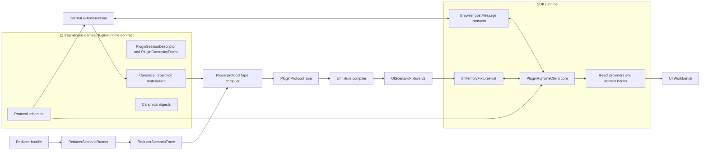

# Plugin Runtime Contract Hard Cut

Status: accepted design amendment on 2026-06-17. This amendment reopens Phase
02 and Phase 03 and blocks Phase 04 until the replacement contracts are in
place.

## Decision

Delete `PluginStateSnapshot` as a public runtime, wire protocol, and fixture
boundary.

Replace it with three deliberately separate contracts:

1. `ReducerScenarioTrace` records deterministic reducer execution for testing
   and fixture compilation.
2. `PluginSessionDescriptor` and `PluginGameplayFrame` are the only
   plugin-visible state contracts.
3. `PluginProtocolTape` records host-to-plugin frames and plugin-to-host command
   results for deterministic replay.

Create a standalone, browser-free package named
`@dreamboard-games/plugin-runtime-contract`. It owns the protocol schemas,
plugin-facing frame types, canonical projection materialization, and digests.
Both the SDK runtime client and the internal host import this package. Neither
repository may maintain a second handwritten protocol schema.

The fixture path must run the real SDK runtime client against an in-memory host
transport. It must not implement another `PluginRuntimeAPI`.

## Why `PluginStateSnapshot` is the wrong boundary

The current type is named and documented as reducer-native state, but it mixes
unrelated ownership domains:

| Current field   | Actual owner                                      |
| --------------- | ------------------------------------------------- |
| `view`          | Reducer seat projection                           |
| `gameplay`      | Reducer flow and projected interaction material   |
| `lobby`         | Host session and player-directory state           |
| `notifications` | Host activity and feedback UI                     |
| `session`       | Host identity and perspective selection           |
| `history`       | Host-only session navigation                      |
| `syncId`        | Transport delivery and acknowledgment bookkeeping |

This creates concrete failure modes:

- `session` is sent in `init`, copied into every state snapshot, and maintained
  again in a separate React session context.
- `syncId` exists in both the state-sync envelope and its body without an
  equality invariant.
- the type says `lobby` is null after gameplay starts, while the production
  host always sends it because gameplay hooks use it as a player roster.
- host-only history, notification, and player-switching behavior leaks into
  authored game UI and fixture schemas.
- the production host has real `version` and `actionSetVersion` values, but the
  plugin frame drops them and exposes activity `syncId` instead.
- the SDK and internal host maintain different protocol validators; the
  internal validator checks only that state is an object with `session` and
  `notifications`.
- fixture and screenshot helpers must invent lobby, notification, history,
  session, and sync values even when they only need a reducer projection.

`PluginStateSnapshot` is therefore a convenience aggregate, not a stable
contract. Keeping it and introducing a scenario runner would preserve the
largest source of coupling.

## Target architecture



## Contract ownership

| Layer                                 | Owns                                                                                   | Must not own                                                  |
| ------------------------------------- | -------------------------------------------------------------------------------------- | ------------------------------------------------------------- |
| `ReducerScenarioRunner`               | Reducer state, validation, dispatch, projection calls, deterministic reducer step IDs  | Session UI, browser identity, transport sequence, React state |
| `plugin-runtime-contract`             | Plugin frame/session schemas, protocol envelopes, projection materialization, digests  | Host stores, React, iframe APIs, fixture replay instructions  |
| Internal `ui-host-runtime`            | Lobby, history, notifications, player switching, authority ingress, transport delivery | A duplicate plugin protocol or authored game UI state model   |
| SDK `PluginRuntimeClient`             | Protocol consumption, current session/frame stores, validation and submission commands | Reducer execution, host chrome, browser globals               |
| `InMemoryFixtureHost`                 | Ordered command expectations and deterministic protocol emissions                      | A second runtime API or reducer authority                     |
| Workbench and browser replay adapters | Render module identity, semantic interaction resolution, physical browser input        | Reducer truth or host session policy                          |

The dependency direction is one way:

```text
reducer-contract + manifest-contract
  -> plugin-runtime-contract
    -> sdk runtime
    -> internal ui-host-runtime
    -> fixture compiler
```

Move every nested wire type used by `PluginGameplayFrame`, including
`InteractionDescriptor`, `ZoneHandlesSnapshot`, `SimultaneousPhaseSnapshot`,
`ValidationResult`, `SubmissionResult`, and the JSON value schema, into the
contract package or one of its lower-level dependencies. The contract package
must never import `@dreamboard-games/sdk`.

## Plugin-visible state

The plugin receives immutable gameplay-session metadata once and revisioned
gameplay frames over time.

```ts
export interface PluginPlayerSummary {
  readonly playerId: PlayerId;
  readonly displayName: string;
  readonly color?: string;
}

export interface PluginSessionDescriptor {
  readonly sessionId: string;
  /** Turn order is the order of this array. */
  readonly players: readonly PluginPlayerSummary[];
}

export interface PluginGameplayFrame<
  View = unknown,
  Phase extends string = string,
  Stage extends string = string,
  Interaction extends string = string,
> {
  readonly gameVersion: number;
  readonly actionSetVersion: string;
  readonly perspectivePlayerId: PlayerId | null;
  readonly view: View | null;
  readonly flow: {
    readonly currentPhase: Phase | null;
    readonly currentStage: Stage | null;
    readonly activePlayers: readonly PlayerId[];
    readonly simultaneousPhase: SimultaneousPhaseSnapshot | null;
  };
  readonly availableInteractions: ReadonlyArray<
    InteractionDescriptor<Interaction>
  >;
  readonly zones: Readonly<Record<string, ZoneHandlesSnapshot<Interaction>>>;
}
```

The authored plugin is a gameplay surface. The host mounts it after a valid
gameplay frame exists; pre-game lobby readiness and start controls remain
outside the iframe.

Deliberate omissions:

- no `userId` or controller principal;
- no `controllablePlayerIds`;
- no lobby readiness or `canStart`;
- no host identity;
- no notification queue;
- no history navigation state;
- no transport sequence.

The host owns perspective switching. A switch produces a new
`PluginGameplayFrame` for the selected perspective. Authored game UI can render
the ordered player roster but cannot request a host perspective mutation.

If authored game UI later needs reducer-defined transient events, add a
separate versioned `gameplay.event` contract. Do not reuse the host notification
queue.

## Canonical projection materialization

Production host code, reducer scenario compilation, screenshot tooling, and
fixture generation currently materialize plugin state independently. Replace
those implementations with one pure function in
`@dreamboard-games/plugin-runtime-contract`:

```ts
export function materializePluginGameplayFrame(input: {
  readonly currentPhase: string | null;
  readonly activePlayers: readonly PlayerId[];
  readonly dynamicProjection: Wire.SeatProjectionBundle;
  readonly staticProjection?: Wire.BoardStaticProjection | null;
  readonly perspectivePlayerId: PlayerId | null;
  readonly gameVersion: number;
  readonly actionSetVersion: string;
}): PluginGameplayFrame;
```

This function owns:

- accepting normalized flow facts from either the reducer runner or authority
  host adapter;
- selecting the perspective seat projection;
- hydrating interaction references;
- hydrating zone interaction references;
- composing static and dynamic board projection;
- validating the resulting strict frame schema.

No host or fixture adapter may hand-build a gameplay frame. The reducer runner
reads flow facts from `ReducerSessionState`; the production host reads the same
facts from its authority viewport.

The contract package also owns the canonical action-set revision algorithm:

```ts
export function computePluginActionSetVersion(input: {
  readonly gameVersion: number;
  readonly availableInteractions: readonly InteractionDescriptor[];
}): string;
```

Reducer fixtures and every production executor use this helper. Node and
sandbox implementations must not maintain different hash algorithms.

## Protocol version 3

Cut the plugin protocol from version `2` to version `3`. Do not add compatibility
fields to `PluginStateSnapshot`.

```ts
export type HostToPluginPayloadV3 =
  | {
      readonly type: "runtime.init";
      readonly session: PluginSessionDescriptor;
    }
  | {
      readonly type: "gameplay.frame";
      readonly frame: PluginGameplayFrame;
    }
  | {
      readonly type: "interaction.validation-result";
      readonly requestId: string;
      readonly result: ValidationResult;
    }
  | {
      readonly type: "interaction.submit-result";
      readonly requestId: string;
      readonly result: SubmissionResult;
    };

export interface PluginProtocolEnvelope<Payload> {
  readonly protocol: "dreamboard-plugin";
  readonly version: 3;
  readonly channelId: string;
  /** Delivery order only. It is not a game revision. */
  readonly sequence: number;
  readonly payload: Payload;
}
```

Acknowledgments echo the envelope `sequence`. The frame carries actual
`gameVersion` and `actionSetVersion`. There is no body-level `syncId`.

Validation and submission commands include the current frame basis:

```ts
export interface PluginInteractionBasis {
  readonly gameVersion: number;
  readonly actionSetVersion: string;
  readonly perspectivePlayerId: PlayerId | null;
}

export interface ValidateInteractionCommand {
  readonly type: "interaction.validate";
  readonly requestId: string;
  readonly basis: PluginInteractionBasis;
  readonly interactionId: string;
  readonly params: RuntimeJson;
}
```

The authored runtime API no longer accepts a caller-supplied `playerId`.
`PluginRuntimeClient` derives the perspective and revision basis from the
current frame:

```ts
export interface PluginRuntimeClient {
  getSession(): PluginSessionDescriptor | null;
  subscribeSession(listener: () => void): () => void;
  getFrame(): PluginGameplayFrame | null;
  subscribeFrame(listener: () => void): () => void;
  validateInteraction(
    interactionId: string,
    params: unknown,
  ): Promise<ValidationResult>;
  submitInteraction(interactionId: string, params: unknown): Promise<void>;
  disconnect(): void;
}
```

This prevents authored UI from selecting an arbitrary actor and gives the host
an explicit stale-frame check.

## Reducer scenario trace

`ReducerScenarioTrace` is an SDK testing contract. It may contain reducer state
for debugging, but it is never serialized as a portable UI fixture.

```ts
export interface ReducerScenarioTrace {
  readonly scenarioId: string;
  readonly gameId: string;
  readonly viewer: {
    readonly seatId: string;
    readonly playerId: PlayerId;
  };
  readonly frames: readonly {
    readonly id: string;
    readonly reducerState: Wire.ReducerSessionState;
    readonly dynamicProjection: Wire.SeatProjectionBundle;
    readonly staticProjection?: Wire.BoardStaticProjection | null;
    readonly gameVersion: number;
    readonly actionSetVersion: string;
    readonly projectionDigest: string;
  }[];
  readonly exchanges: readonly ReducerScenarioExchange[];
}

export type ReducerScenarioExchange =
  | {
      readonly id: string;
      readonly operation: "validate";
      readonly fromFrameId: string;
      readonly input: TrustedRuntimeInput;
      readonly result: Wire.ReducerInputValidationResult;
    }
  | {
      readonly id: string;
      readonly operation: "submit";
      readonly fromFrameId: string;
      readonly input: TrustedRuntimeInput;
      readonly result:
        | {
            readonly kind: "accepted";
            readonly toFrameId: string;
          }
        | {
            readonly kind: "rejected";
            readonly diagnostics: readonly Diagnostic[];
          };
    };
```

Validation has no `toFrameId`. A successful validation is observational and
must not publish a new frame. This distinction is encoded in the type instead
of relying on adapter discipline.

The runner receives an explicit initial `gameVersion`, increments it only after
accepted dispatch, and computes each frame's `actionSetVersion` with
`computePluginActionSetVersion`.

## Fixture schema version 2

The portable fixture stores session metadata once and gameplay frames
separately. It does not serialize a runtime aggregate.

```ts
export interface PluginProtocolTape {
  readonly session: PluginSessionDescriptor;
  readonly frames: readonly {
    readonly id: string;
    readonly frame: PluginGameplayFrame;
    readonly projectionDigest: string;
  }[];
  readonly steps: readonly PluginProtocolStep[];
}

export type PluginProtocolStep =
  | {
      readonly id: string;
      readonly kind: "host.frame";
      readonly frameId: string;
    }
  | {
      readonly id: string;
      readonly kind: "client.validate";
      readonly fromFrameId: string;
      readonly requestDigest: string;
      readonly response: ValidationResult;
    }
  | {
      readonly id: string;
      readonly kind: "client.submit";
      readonly fromFrameId: string;
      readonly requestDigest: string;
      readonly response: SubmissionResult;
    };
```

`UIScenarioFixtureV2` composes this tape with render module identity, browser
replay steps, environment controls, and expected browser observations. It does
not add host state back into protocol frames.

The fixture host sends `runtime.init` from `tape.session`, then drains the
leading `host.frame` step.

An accepted submit step is followed by a separate `host.frame` step when the
scenario produces a new projection. The harness sends the submit result before
the frame, matching production. A rejected submit has no resulting frame step.

Remove `refresh` as a plugin command exchange. Initial, post-submit, and
independent host-driven frame delivery are all explicit `host.frame` steps, not
requests made by authored game UI.

## Runtime execution

Both production and fixture execution instantiate the same transport-agnostic
runtime client:

```ts
const transport = createPostMessagePluginTransport(window, options);
const runtime = createPluginRuntimeClient({ transport });
```

The fixture path substitutes only the host side:

```ts
const harness = createFixtureHostHarness({ tape: fixture.protocol });
const runtime = createPluginRuntimeClient({ transport: harness.transport });

root.render(
  <PluginRuntimeBoundary runtime={runtime}>
    <module.Root />
  </PluginRuntimeBoundary>,
);
```

`createFixtureHostHarness`:

- sends the same version 3 envelopes as the browser host;
- drains leading host steps and validates ordered client command digests;
- returns validation and submission results;
- emits frames only from explicit `host.frame` tape steps;
- records acknowledgments and render commits;
- fails closed on unsupported or unconsumed protocol steps.

Delete the current `createFixtureRuntime` implementation after this harness is
green. `createTestRuntime` remains available for reducer and component tests
but is not used by fixture compilation.

## SDK runtime organization

```text
packages/plugin-runtime-contract/
  src/frame.ts
  src/projection.ts
  src/protocol.ts
  src/schema.ts
  src/digest.ts

packages/sdk/src/runtime/
  core/create-plugin-runtime-client.ts
  core/runtime-store.ts
  core/types.ts
  browser/post-message-transport.ts
  react/PluginRuntime.tsx
  react/PluginRuntimeBoundary.tsx
  react/PluginSessionContext.tsx
  react/PluginGameplayFrameContext.tsx
  react/hooks/

packages/sdk/src/testing/
  reducer-scenario/create-reducer-scenario-runner.ts
  reducer-scenario/types.ts
  ui-fixture/compile-plugin-protocol-tape.ts
  ui-fixture/create-fixture-host-harness.ts
  ui-fixture/schema.ts
```

React state is split by responsibility:

- session context exposes ordered player summaries and session identity;
- gameplay frame context exposes the current reducer projection;
- runtime command context exposes validation and submission;
- interaction draft state remains SDK-local UI state.

Remove public `usePluginStateSnapshot` and broad `usePluginState` exports.
Generated primitives should use internal frame selectors. Public authored hooks
remain domain-specific: `useGameView`, `useGameSelector`, `usePlayers`, `useMe`,
`useActivePlayers`, `useSimultaneousPhase`, and generated interaction hooks.

Replace `useLobby` and `usePlayerTurnOrder` with the immutable session player
directory. Remove `PlayerRoster.SwitchButton`; host UI owns perspective
switching.

## Internal host organization

The internal host keeps:

- lobby readiness and start controls;
- host and controller principals;
- controllable and switchable player IDs;
- history navigation;
- notification and feedback queues;
- authority ingress and SSE state;
- iframe lifecycle and delivery acknowledgments.

It exports only `PluginSessionDescriptor` and `PluginGameplayFrame` across the
plugin boundary.

Delete:

- `selectPluginSnapshot`;
- the internal handwritten `plugin-messages.ts` schemas;
- snapshot assembly in screenshot and preview-worker helpers;
- plugin handlers for `restore-history`, `mark-notification-read`, and
  `switch-player`.

Host controls call the host session store directly. Screenshot and preview
helpers use the canonical frame materializer and protocol schemas.

## Hard-cut migration sequence

1. Add `@dreamboard-games/plugin-runtime-contract` with strict version 3
   schemas, projection materialization, action-set revision hashing, and
   contract tests.
2. Add `ReducerScenarioRunner` and compile reducer traces without importing
   runtime, React, fixture, or browser modules.
3. Compile `PluginProtocolTape` from a reducer trace plus explicit fixture
   session metadata. Regenerate fixtures as schema version `2`.
4. Extract `PluginRuntimeClient` from browser globals and implement the
   postMessage transport as an adapter.
5. Replace `createFixtureRuntime` with `createFixtureHostHarness` and run the
   real client in Workbench tests.
6. Migrate React providers and generated primitives to session/frame contexts
   and actor-free command methods.
7. Migrate internal `ui-host-runtime` to the shared package and canonical frame
   materializer.
8. Delete `PluginStateSnapshot`, protocol version `2`, fixture schema version
   `1`, duplicate schemas, host-only plugin actions, and compatibility
   adapters.

A temporary adapter may exist while one migration branch is in progress. Phase
03 does not close while either protocol remains callable or any committed
fixture uses schema version `1`.

## Deletion gate

The hard cut is complete only when all of these searches are empty outside
historical docs and migration receipts:

```bash
rg "PluginStateSnapshot|StateSyncMessage|state-sync" packages scripts examples
rg "restoreHistory|markNotificationRead|switchPlayer" packages/sdk/src/runtime
rg "createFixtureRuntime|uiFixturePluginStateSnapshotSchema" packages scripts
rg "plugin-messages" ../internal/packages/ui-host-runtime
```

Additional invariants:

- the SDK and internal host import one protocol schema package;
- every gameplay frame preserves `gameVersion` and `actionSetVersion`;
- envelope sequence and game revision are different values with different
  tests;
- accepted validation never changes the current frame;
- only an accepted submission or explicit host emission advances a frame;
- fixture compilation never imports `createTestRuntime`;
- fixture JSON contains no lobby, notification, history, user, controller, or
  switchability data;
- production browser transport and fixture transport pass the same runtime
  client contract suite.

## Phase impact

- Phase 02 is reopened. Its `PluginStateSnapshot` fixture frames are replaced
  by `PluginProtocolTape` and `PluginGameplayFrame`, and the fixture schema
  becomes version `2`.
- Phase 03 is reopened. Its fake `PluginRuntimeAPI` is replaced by
  `PluginRuntimeClient` plus `InMemoryFixtureHost`.
- Phase 04 remains blocked until regenerated fixtures mount through the real
  client and the version 3 protocol.
- Existing Phase 02 and Phase 03 receipts remain historical records of the
  superseded implementation, not completion evidence for the amended plan.

## SDK implementation receipt: 2026-06-17

Migration steps 1-3 are implemented in the SDK repository:

- `@dreamboard-games/plugin-runtime-contract` owns protocol schemas, plugin
  frame/session contracts, projection materialization, canonical JSON/digests,
  and action-set hashing;
- `ReducerScenarioRunner` records reducer-owned traces without importing React,
  runtime, fixture, or browser modules;
- `compilePluginProtocolTape` converts reducer traces into session metadata,
  gameplay frames, and ordered protocol steps;
- reference fixtures were regenerated as fixture schema version `2` with plugin
  runtime protocol `3`.

Migration steps 4-5 are implemented for the SDK and Workbench fixture path:

- `PluginRuntimeClient` is extracted as a transport-agnostic version `3`
  runtime core with session/frame stores, request correlation, actor-free
  validation/submission methods, and delivery acknowledgments;
- `createPostMessagePluginTransport` owns browser `window.postMessage`
  binding, channel validation, and authenticated version `3` envelopes;
- `createFixtureHostHarness` implements the in-memory host side of the same
  transport contract and drains ordered `PluginProtocolTape` steps;
- `packages/ui-workbench` now loads fixtures through
  `createFixtureHostHarness` plus the real `PluginRuntimeClient`;
- `createFixtureRuntime` and its fixture-only runtime implementation were
  deleted from SDK testing exports.

Verification run for this slice:

```bash
mise exec node@24 -- pnpm --filter @dreamboard-games/sdk typecheck
cd packages/sdk && mise exec node@24 -- bun test src/runtime/browser src/testing/ui-fixture src/export-surface.test.ts
mise exec node@24 -- pnpm --filter @dreamboard-games/ui-workbench typecheck
mise exec node@24 -- pnpm --filter @dreamboard-games/ui-workbench test
mise exec node@24 -- pnpm docs:generate
```

Migration step 6 is implemented for the SDK authored runtime surface:

- `PluginRuntimeBoundary` mounts version `3` `PluginRuntimeClient` instances
  through `PluginSessionProvider` and `PluginGameplayFrameProvider`, while the
  legacy `PluginRuntimeAPI` path is isolated behind a compatibility frame
  provider;
- generated hooks and primitives read gameplay flow, interactions, zones,
  lobby/player summaries, and reducer view data from plugin session/frame
  contexts instead of the public `PluginStateSnapshot` aggregate;
- `RuntimeAPI.validateInteraction` and `RuntimeAPI.submitInteraction` are
  actor-free author commands that derive the controlling player from session
  state;
- SDK-authored UI no longer exports `usePluginActions`,
  `PlayerRoster.SwitchButton`, `PlayerRosterSwitchButton`, or plugin-to-host
  payloads for `restore-history`, `mark-notification-read`, and
  `switch-player`;
- session/frame external-store providers cache derived snapshots so hosts and
  tests are not required to preserve object identity for every projected read.

Verification run for this slice:

```bash
mise exec node@24 -- pnpm --filter @dreamboard-games/sdk typecheck
cd packages/sdk && mise exec node@24 -- bun test src/runtime/api/createPluginRuntimeAPI.test.ts src/runtime/hooks src/runtime/primitives/hand-mobile-registration.test.tsx src/runtime/workspace-contract.test.tsx src/testing/ui-fixture src/export-surface.test.ts
mise exec node@24 -- pnpm --filter @dreamboard-games/sdk build
mise exec node@24 -- pnpm docs:generate
mise exec node@24 -- pnpm docs:check
rg "PlayerRosterSwitchButton|restoreHistory|markNotificationRead|switchPlayer" packages/sdk/src docs/reference packages/sdk/REFERENCE.md -g '!**/node_modules/**'
rg "validateInteraction\([^\n]*playerId|submitInteraction\([^\n]*playerId|validateInteraction\([^,]+,[^,]+,[^\n]+\)|submitInteraction\([^,]+,[^,]+,[^\n]+\)" packages/sdk/src docs/reference packages/sdk/REFERENCE.md -g '!**/node_modules/**'
```

Steps 7-8 remain open. `PluginStateSnapshot`, protocol version `2`, and
compatibility adapters still exist until the internal `ui-host-runtime` imports
the shared contract package and the final cross-repo deletion gate is empty.
