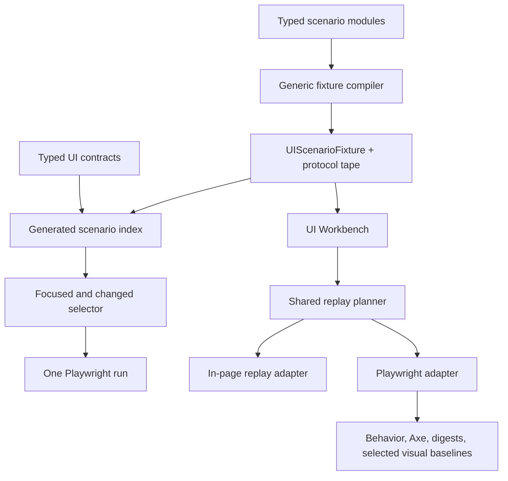

# UI Primitive Coverage And Agent Loop

Status: Proposed

Planned at SDK commit: `92179a4bbf10`

Predecessor:
[UI Agent Iteration Workbench](../ui-agent-iteration-workbench/README.md)

## Goal

Make it fast for coding agents to add or change SDK UI primitives, inspect the
result without a backend, and run focused behavior and visual checks.

This plan keeps the useful current split:

- Storybook for isolated component presentation.
- Workbench for runtime-generated UI and interaction behavior.
- An in-memory host and portable fixture tape instead of a backend.

It does not turn this codebase into a release-certification system.

## What needs to change

The current workflow has four framework problems:

1. Component ownership is repeated across coverage declarations, generator
   maps, selectors, and fixture metadata.
2. Fixture compilation branches on specific replay shapes and synthesizes a
   generic reducer instead of loading scenario modules.
3. Changed-only selection uses filename heuristics and starts Playwright
   repeatedly.
4. Interactive Replay bypasses the semantic browser path, while runtime
   screenshots are not useful visual regression checks.

## Minimal target design



### One typed contract

Add a small public testing contract for:

- UI component or primitive IDs;
- scenario definitions;
- explicit source files or source globs;
- components and primitives exercised by a scenario;
- replay steps;
- viewport and input requirements;
- protocol-authoritative or reducer-authoritative fixture generation.

Do not build a general TypeScript dependency analyzer in the first iteration.
Explicit source ownership is simpler, reviewable, and enough for changed-only
selection.

### One generated index

Generate a single index from typed contracts and compiled scenarios:

`fixtures/ui/component-scenario-index.json`

Extend the existing artifact instead of introducing a second graph. It should
contain:

- contracts;
- scenarios;
- source ownership;
- components and primitives exercised;
- capabilities;
- viewport and browser hints.

The catalog, docs, coverage check, and changed selector consume this index.

### Two scenario authorities

Both compile to the existing fixture and protocol tape:

- Primitive scenarios provide small deterministic protocol states. They test
  SDK contracts directly.
- Reference-game scenarios execute the game's actual reducer bundle. They test
  representative game compositions.

The compiler must not synthesize a fake reducer for reducer-authoritative
scenarios.

### One replay plan

Interactive Replay and Playwright resolve the same semantic replay steps.

- The in-page adapter is for fast debugging.
- The Playwright adapter performs real click, tap, fill, press, and drag
  actions.

Interactive Replay must not call runtime submission APIs directly.

### One fast runner

Focused and changed-only commands write or construct one selection and invoke
Playwright once. The Workbench build and server start once per run.

Keep a small default smoke matrix:

- `hearts.pass-three.mobile`
- `hex-network-trading.place-route.desktop`
- `worker-placement-tableau.place-worker.desktop`

Additional scenarios run when selected by component, capability, scenario ID,
or changed source ownership.

## Scenario coverage strategy

Build small scenarios, not full games.

Primitive scenario families:

- cards, hands, hidden information, drag and drop;
- zones, piles, lists, staging, and transfer;
- prompts, choices, validation, and submission;
- dice and result state;
- resources, costs, and payment;
- square, hex, network, track, area, and slot boards;
- player roster, phase, game shell, and terminal outcome.

Reference-game archetypes:

- trick-taking and simultaneous selection;
- worker placement and form mutation;
- deck-building and zone mutation;
- drafting and private reveal;
- grid targeting;
- network building and drag.

Add scenarios incrementally as primitives are implemented. The framework should
report gaps, but this plan does not require exhaustive closure before it is
useful.

## Phases

| Phase | Name                                                                               | Result                                                    |
| ----- | ---------------------------------------------------------------------------------- | --------------------------------------------------------- |
| 00    | [Core contract and generated index](phase-00-core-contract-and-index.md)           | One source of ownership and selection truth               |
| 01    | [Generic scenario compiler](phase-01-generic-scenario-compiler.md)                 | Scenario modules replace branch-heavy fixture compilation |
| 02    | [Primitive and archetype scenarios](phase-02-primitive-and-archetype-scenarios.md) | Representative backend-free coverage                      |
| 03    | [Fast runner and unified replay](phase-03-fast-runner-and-unified-replay.md)       | One Playwright run and one semantic replay path           |
| 04    | [Visual loop, cleanup, and docs](phase-04-visual-loop-cleanup-and-docs.md)         | Useful visual checks and deletion of old authorities      |

Phases 00 and 01 establish the framework. Phase 02 can grow incrementally.
Phase 03 should land early enough that new scenario work benefits from the fast
runner. Phase 04 closes the old paths once the new loop is working.

## Normal agent loop

Presentation work:

```sh
pnpm ui:storybook
pnpm ui:test --component <component-id>
```

Runtime work:

```sh
pnpm ui:workbench:src --scenario <scenario-id>
pnpm ui:test --scenario <scenario-id>
```

Before handoff:

```sh
pnpm ui:test:changed --base <ref>
pnpm ui:fixtures:check
pnpm ui:catalog:check
pnpm docs:check
```

Shared fixture, runtime, or browser-driver changes still run the existing full
UI suite.

## Essential verification

Keep verification close to the changed framework:

- unit tests for typed contracts and fixture compilation;
- focused Workbench browser tests;
- one full UI suite for shared runtime changes;
- Storybook visual checks for component presentation;
- a small set of Workbench visual baselines for runtime composition;
- stale generated-output checks.

Screenshots and JSON receipts may remain useful debug artifacts, but this plan
does not require checked-in receipts, immutable release evidence, or
cross-repository closeout documents.

## Explicitly deferred

The following are not part of this plan:

- generated weighted set-cover portfolios;
- exact public export dependency analysis;
- packed-consumer expansion;
- release-tarball certification;
- internal real-host parity changes;
- device canaries;
- timing budgets;
- versioned migration reports;
- phase receipts and closeout artifacts;
- proving every primitive, archetype, browser, and viewport combination.

Existing packed and parity workflows may continue to run. They are not blockers
for implementing or closing this framework redesign.

## Done

The plan is complete when:

1. one typed contract and generated index own component, primitive, scenario,
   capability, and source relationships;
2. scenario modules compile through one generic protocol or reducer authority
   path;
3. reducer scenarios execute actual reference reducer bundles;
4. focused and changed-only tests use the generated index;
5. the selected Workbench matrix runs in one Playwright invocation;
6. interactive and Playwright replay share semantic resolution;
7. a few representative runtime visual baselines catch obvious composition
   regressions;
8. duplicate maps, synthetic reducer compilation, filename heuristics, and
   direct interactive submission are removed;
9. the normal backend-free agent loop is documented and passes the relevant UI
   checks.
